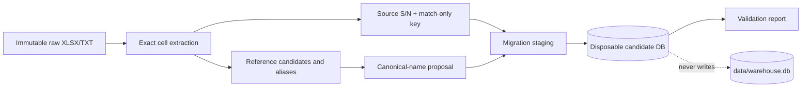
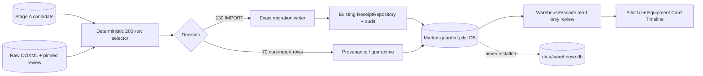

# Архитектура ODE

## ODE 0.14 initial-inventory boundary

`data/warehouse.db` остаётся legacy historical read model и не получает FULL
Inventory writes. `inventory/warehouse/baseline/` владеет status/posting gate,
external workspace, XLSX Preview и resolutions. `baseline_rehearsal/` —
единственный anti-corruption bridge, которому разрешено читать проверенное
Preview evidence и создавать отдельную target ODE DB через approved V001..V008.
Legacy Warehouse и `ode/` не импортируют друг друга; bridge проверяется
module-boundary audit. Publish в operational path отсутствует.

## Warehouse stabilization runtime

Текущий активный read/write модуль — Warehouse. Глобальный shell показывает
компактную шапку и module cards; после входа в Склад router использует
существующий section/view механизм и не создаёт второй router. Monitoring и
Reports UI заканчиваются на placeholder и не вызывают Warehouse internals.
Monitoring backend содержит только изолированный hostname routing по локальным
JSON rules; внешние collectors и email transport отсутствуют.

Reference Data имеет один путь:

```text
Warehouse UI → existing HTTP API → ApplicationContext → WarehouseFacade
             → ReferenceDataService → data/warehouse.db/reference_*_v2
```

Формы читают только `active=1 AND approval_status='APPROVED'`. `model.scope_key`
равен нормализованному vendor key. Pending/inactive/alias строки доступны
редактору, но не обычным dropdown. Rename, deactivate и merge меняют canonical
слой и audit, сохраняя operational raw fields и migration provenance.

Global search выполняет exact S/N/Inventory Number индексные запросы прежде
ограниченного поиска по полям. Exact hit прекращает широкие ветки. Equipment
Card дополняет operational позицию canonical/source/Part Number, но техническая
migration confidence/provenance остаётся в `Администрирование ODE → Миграция`.

Дата проверки: 2026-07-16. Текущий source/runtime: `0.14.0`. Последний фактически
собранный Windows ZIP содержит `ODE 0.12.17 RC1`; ZIP RC2/Stage
0.13.2/Stage 0.13.3A/Stage 0.13.3A.5 не
создавался.

## Текущий локальный runtime contour

`data/warehouse.db` — единственный normal-start target. Проверенный full
historical candidate был опубликован в этот путь через sibling
`data/warehouse.db.next` и атомарный `os.replace`; исходный candidate не
изменялся. При `python3 app.py` не требуется migration mode, UI открывается на
обычной главной странице, а marker/provenance внутри БД не превращает runtime
в read-only review.

Операционный read-path не раздваивается:

```text
normal UI / HTTP
  -> ApplicationContext.warehouse
  -> WarehouseFacade
  -> existing Warehouse services
  -> stock_receipts - stock_issue_allocations (+ stock_issues/history)
  -> data/warehouse.db
```

`migration_full_*`, staging и reference-v2 tables сохраняют provenance и
доступны административной диагностике. Они не формируют отдельный пользовательский
склад и не выводят `TEXT_EXACT`, `NUMERIC_PROVISIONAL`, reconciliation/source
rows в обычные карточки и Timeline. Legacy `equipment/operations` остаются
совместимыми таблицами, но не являются источником текущих 50 000 карточек,
баланса или dashboard KPI.

Promotion относится только к локальному single-node ODE. Серверный production
deployment, multi-user topology и release transport здесь не реализованы.

## Назначение системы

ODE — локальное браузерное приложение дежурной смены для складского учёта,
поставок, логов работ и отчётов. Runtime использует Python standard library и
один SQLite-файл; внешние сервисы для основных операций не требуются.

Главный бизнес-идентификатор сериализованного оборудования и компонентов —
S/N. Inventory Number является вторичным реквизитом и может быть назначен
позже. Кабели учитываются отдельно по количеству/метражу и не обязаны иметь
S/N.

## Компоненты

```text
app.py
 ├─ inventory/webapp.py        HTTP server, session/auth, HTML shell, API routes
 └─ inventory/cli.py           compatibility CLI
             │
             ▼
 inventory/
 ├─ core/                      ApplicationContext, feature flags, event contracts
 ├─ warehouse/                 receipts, issues, cables, deliveries, balance/history
 ├─ reports/                   work logs, daily/weekly reports
 ├─ administration/            users, audit read, backup/restore, diagnostics
 ├─ monitoring/                isolated hostname routing; UI/collectors future
 ├─ shared/                    SQLite/CSV/audit/validation adapters
 ├─ migration/                 offline source/reference/staging bounded context
 └─ db.py                      schema and idempotent migrations
             │
             ▼
 data/warehouse.db             working SQLite database
```

`inventory/migration/` не является пятым runtime-модулем ODE. Это
offline bounded context с отдельным lifecycle; его builder не включён в
`ApplicationContext` или HTTP handler. Сохранённые им provenance-таблицы могут
находиться в promoted рабочей БД, но normal runtime их не пишет и использует
только через существующий административный review adapter.
Stage 0.13.3A.5 добавляет Warehouse-owned pilot writer/review adapter, но
runtime по-прежнему не импортирует `inventory/migration`: offline CLI инъецирует
writer при сборке, а browser читает только allowlisted pilot tables через
`WarehouseFacade`. Output живёт только в ignored `migration_inputs/`.

`ApplicationContext` является composition root. Web/API обращается к публичным
`WarehouseFacade`, `ReportsFacade`, `AdministrationFacade` и
`MonitoringFacade`. `WarehouseCore`/`WarehouseService` сохраняются как
compatibility layer для ещё не мигрированных сценариев, но новая доменная
логика не должна вызываться из webapp напрямую через core.

Модульные границы контролирует `scripts/audit_module_boundaries.py`. Владение
таблицами описано в [docs/DATABASE_OWNERSHIP.md](docs/DATABASE_OWNERSHIP.md),
полная карта стадий — в
[docs/MODULE_ARCHITECTURE.md](docs/MODULE_ARCHITECTURE.md).

## HTTP и frontend

`inventory/webapp.py` формирует итоговый HTML shell и HTTP handler. В конце
сборки `_externalized_html()` подключает фактические runtime assets из
`static/css/main.css` и `static/js/**`; большие legacy inline-константы не
следует считать единственным источником браузерного поведения.

Frontend разделён на `static/js/core`, `warehouse`, `reports`,
`administration`, `monitoring` и общие components. Контракт статических DOM id
проверяет `scripts/audit_frontend_contracts.py`, а реальное поведение —
`tests/headless_smoke.js` через `scripts/smoke_ui.py`.

Основные HTTP группы:

- read API и exports/templates — GET `/api/**`, `/export/**`, `/import/**`;
- write actions — POST `/api/action`;
- CSV preview — POST `/api/preview-csv?kind=...`;
- разрешённые direct imports — POST `/api/import-csv?kind=...`;
- authentication/session — `/api/login`, `/api/logout`.

В marker-guarded Stage 0.13.3A.5 pilot mode добавлены только read routes
`GET /api/migration-pilot` и
`GET /api/position-card?pilot_selection_id=...`. Обычный runtime их не
активирует; pilot backend отклоняет operational POST mutations.

Новые actions должны проходить через соответствующий facade, возвращать plain
JSON values, использовать текущий actor context и не раскрывать traceback,
секреты или абсолютные локальные пути.

## Данные и транзакции

Основные таблицы:

- Warehouse: `stock_receipts`, `stock_issues`,
  `stock_issue_allocations`, `deliveries`, `delivery_lines`, legacy
  `equipment`/`operations`;
- Reports: `work_logs`, `daily_report_uploads`, `daily_report_rows`;
- Administration/shared infrastructure: `users`, `audit_log`,
  `reference_values` до дальнейшего разделения.

Баланс вычисляется из receipts минус issue allocations; отдельная mutable
таблица баланса не ведётся. Reports получает warehouse facts через
`WarehouseEventReader`, а не прямой SQL к warehouse-owned таблицам.

Массовые write/import операции валидируют данные до записи и задают одну
caller-visible SQLite transaction boundary. Mutation-тесты выполняются только
на временных БД. Любая schema/data migration требует отдельного документа,
backup-процедуры и rollback-плана.

## Stage 0.13.3A: Offline Reference and Migration Foundation

### FACT

- production `reference_values` остаётся плоской runtime-таблицей;
- `stock_receipts`, `stock_issues`, allocations и вычисление баланса не
  изменены;
- рабочая `data/warehouse.db` не является migration target и не
  меняется generator/validator-ом;
- лист `БАЛАНС` остаётся только контрольным snapshot, а не
  источником операций.

### IMPLEMENTED



- `models.py` фиксирует domain/alias/staging contracts;
- `reference_data.py` задаёт controlled domains и безопасную
  normalization/alias policy;
- `canonical_naming.py` генерирует display name из структурных
  полей;
- `xlsx_cells.py` и `serial_preservation.py` отделяют исходный
  identifier от match-only representation и работают с XLSX raw XML
  без float;
- `staging_schema.py`, `candidate_db.py` и `validation.py` владеют
  только disposable candidate-контуром.
- `scripts/migration_reference_data.py` даёт отдельный developer CLI
  `inspect-sources` / `build-candidate` / `validate-candidate` / `report`;
  он не является runtime/application CLI.

Полные инварианты описаны в
[REFERENCE_DATA_ARCHITECTURE.md](docs/REFERENCE_DATA_ARCHITECTURE.md),
[CANONICAL_NAMING.md](docs/CANONICAL_NAMING.md),
[SERIAL_NUMBER_PRESERVATION.md](docs/SERIAL_NUMBER_PRESERVATION.md) и
[MIGRATION_STAGING_ARCHITECTURE.md](docs/MIGRATION_STAGING_ARCHITECTURE.md).

### HISTORICAL STAGE BOUNDARY

- эти пункты описывали состояние до локальной full promotion;
- candidate reference/provenance tables сохранены в рабочем файле, но normal
  runtime `reference_values` и Warehouse contracts не заменены новым master
  data runtime;
- historical receipts/issues опубликованы локально после полного gate;
- dependent reference UI и запрет на silent production reference creation
  требуют отдельной runtime-реализации;
- серверная production migration остаётся отдельной будущей задачей.

## Stage 0.13.3A.5: Preservation-Aware Pilot

### FACT

- ordinary receipt validation применяет `strip().upper()`, поиск/card и
  production partial unique S/N index используют case-insensitive semantics;
- такой flow нельзя использовать как доказательство посимвольной сохранности
  historical S/N;
- фактические sources содержат Vegman R220, но не содержат Vegman R200;
  source row не синтезируется.

### IMPLEMENTED / PILOT ONLY



- selector size/seed/distribution are executable invariants; source candidate,
  workbook and normalized review hashes are pinned;
- `source_serial_value` is written exactly; match-only NFKC/outer trim/casefold
  key never replaces it;
- only `TEXT_EXACT`, quantity-one, date-proven `IMPORT` primaries create cards;
  numeric/corrupted/quantity/unresolved rows do not;
- duplicate/conflict rows link to one identity/card and keep history; shelf is
  optional placement, not identity;
- pilot writer bypasses ordinary normalization but reuses Warehouse
  `ReceiptRepository`, caller-owned transaction and `audit_log`;
- pilot receipts use `is_opening_balance=1`, so Reports does not present them
  as current receipt events; Equipment Card still shows historical migration
  and audit-backed Timeline;
- pilot DB requires exact marker, filename, status, read-only flags,
  integrity/FK/no-sidecar gate and environment opt-in before
  `ApplicationContext` initializes;
- after that guard, pilot startup disables the ordinary service schema
  initializer; the default production startup contract remains unchanged, and
  headless smoke asserts an unchanged pilot-copy SHA;
- pilot UI is role-gated (`admin`/`engineer`), read-only, text-rendered and does
  not expose raw XML, secrets or absolute paths.

Exact selector, tables, API, sequence, events, launchers and rollback/cleanup
contract are in
[docs/MIGRATION_PILOT_ARCHITECTURE.md](docs/MIGRATION_PILOT_ARCHITECTURE.md).

### NOT PRODUCTION / FUTURE 0.13.3B / OPEN DECISION

- pilot DB and reports are ignored disposable artifacts, not backup/import
  packages;
- only 200 rows are selected and 130 cards created; no issue/`БАЛАНС`/bulk
  receipt migration occurs;
- current `COLLATE NOCASE` cannot represent case-distinct S/N as separate
  production identities; any schema change needs a separate ADR;
- manual pilot approval authorizes only a separately scoped next Stage, not
  reset/replacement of the working DB.

## Stage 0.13.1/0.13.2: Inventory Number

Одиночное и массовое назначение используют маршрут:

```text
UI/HTTP
 -> ApplicationContext.warehouse
 -> WarehouseFacade
 -> ReceiptWriteService
 -> ReceiptRepository
 -> SQLite
```

Stage 0.13.1 добавил заполнение пустого Inventory Number в существующей
Equipment Card. Stage 0.13.2 добавил CSV Preview/Confirm поверх того же
transaction-aware repository helper.

Критические инварианты:

- lookup только по case-insensitive `stock_receipts.serial_number`;
- новые карточки не создаются, заполненные другие номера не перезаписываются;
- preview читает БД и хранит план только в Warehouse preview store;
- confirm выполняет `BEGIN IMMEDIATE`, повторный анализ и сравнение с preview;
- все строки `SUCCESS`, legacy sync и audit применяются атомарно;
- direct import для `kind=inventory_numbers` запрещён;
- каждое реальное изменение публикует существующий audit action
  `EQUIPMENT_INVENTORY_NUMBER_ASSIGNED`, который читает Equipment Card
  Timeline; новый WarehouseEventReader event не вводился;
- схема БД не менялась, используются существующие unique constraints/indexes.

Полный API, CSV, status, sequence, security и failure contract находится в
[docs/INVENTORY_NUMBER_IMPORT_ARCHITECTURE.md](docs/INVENTORY_NUMBER_IMPORT_ARCHITECTURE.md).

## Безопасность и роли

- `admin` и `engineer` выполняют operational writes;
- `viewer` остаётся read-only и отклоняется backend, а не только скрытием UI;
- admin-only: пользователи, backup/restore, audit view, production DB upload и
  diagnostics;
- actor/audit author берётся из authenticated application context;
- session cookie — HttpOnly/SameSite, POST проверяет Origin/Host;
- CSV body ограничен 50 МБ, импорт — 40 000 непустых строк;
- preview имеет TTL/лимиты и owner binding согласно конкретному flow.

Подробности — [docs/SECURITY_BOUNDARIES.md](docs/SECURITY_BOUNDARIES.md).

## Известные архитектурные ограничения

- single-process SQLite не предназначен для активной многопользовательской
  записи и server deployment без отдельного решения;
- `inventory/webapp.py` остаётся крупным переходным composition/HTTP файлом;
- `WarehouseCore` и часть legacy service/API flows ещё существуют;
- Warehouse preview хранится в памяти и не переживает restart;
- нет persisted import jobs, progress/cancel и отдельного batch audit ID;
- Monitoring operator UI и внешние интеграции остаются вне текущего runtime;
  реализован только локальный hostname routing через публичный facade;
- корректирующие/сторнирующие операции требуют отдельной модели событий.

Изменения этих ограничений нельзя выполнять массовым refactor: каждый доменный
flow мигрируется через facade с contract/API/headless тестами и синхронным
обновлением документации.
