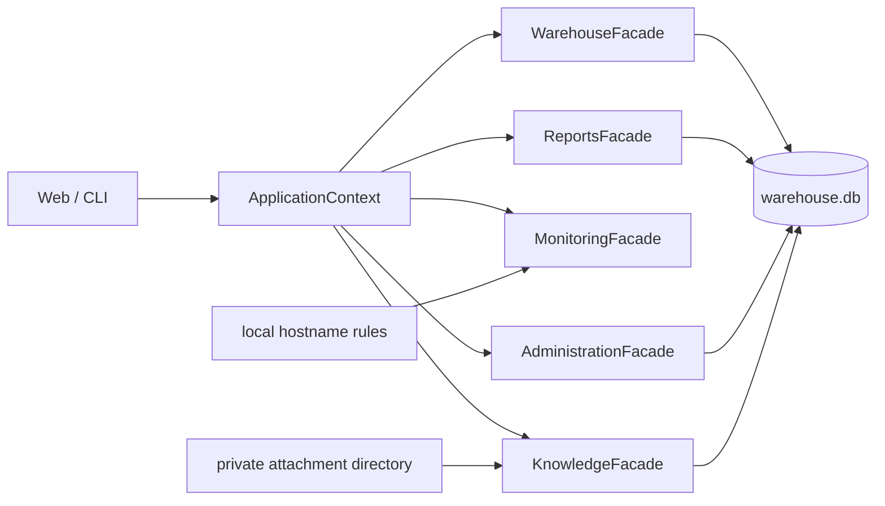

# ODE — Отдел дежурных инженеров

**Локальный рабочий инструмент дежурной смены ЦОД**: складской учёт оборудования
и кабеля, приход/расход со сканером, поставки, инвентаризация, карточки позиций
с полной историей, контроль качества данных, УВР и сменные отчёты, база знаний
и ручной мониторинг.

Работает полностью офлайн: Python (только стандартная библиотека) + SQLite,
интерфейс открывается в браузере на локальном компьютере.

> **Версия 0.15.0** · Python 3.10+ · Windows / macOS / Linux · внешние
> зависимости не требуются · 539 автоматических тестов

## Возможности

- **S/N-first учёт** — серийный номер является главным бизнес-идентификатором
  позиции; инвентарный номер добавляется позже и никогда не создаёт дубль
  карточки. Повторный приход того же S/N и повторное списание уже выданного S/N
  блокируются сервером внутри транзакции.
- **Баланс** — расчёт остатка только из проведённых приходов и расходов
  (`stock_receipts − stock_issue_allocations`), фильтры по проекту, типу,
  вендору, ЦОД и полке, экспорт в Excel-совместимый CSV.
- **Приход и расход** — формой, USB/Bluetooth-сканером (режим клавиатуры) или
  CSV-файлом с обязательным Preview; все подтверждения выполняются одной
  SQLite-транзакцией с полным откатом при ошибке.
- **Кабели** — учёт по количеству/метражу без S/N, списание распределяется
  FIFO по партиям прихода.
- **Поставки** — загрузка документа снабжения, проверка дублей, построчная
  приёмка сканером, внеплановые позиции, закрытие поставки.
- **Инвентаризация** — сверка по списку S/N без записи, массовое назначение
  Inventory Number через Preview/Confirm и полный FULL-workflow с внешним
  disposable baseline-кандидатом.
- **Контроль качества данных** — экран «Проблемы»: неполные исторические
  строки заполняются прямо в таблице (только пустые поля, включая дату с
  ручной пометкой), дубли S/N исправляются или удаляются с подтверждением;
  каждое изменение попадает в аудит.
- **Карточка оборудования** — реквизиты, остаток, размещение, поставка,
  ответственный и полная история (Timeline); редактирование описательных полей
  не меняет S/N и историю операций.
- **УВР и отчёты** — учёт выполненных работ с XLSX-импортом, отчёты за смену и
  неделю (отдельный контур, не пишет в складские таблицы).
- **База знаний** — статьи с безопасным Markdown, теги, поиск, вложения.
- **Мониторинг** — изолированный ручной поиск по hostname, опциональный DCIM
  collector, подготовка текста письма без автоотправки.
- **Безопасность** — роли `admin` / `engineer` / `viewer` на сервере, PBKDF2
  хеши паролей, единый `audit_log` всех операций, резервные копии и
  восстановление с автоматическим страховочным backup.

## Быстрый старт

```bash
python3 app.py
```

Интерфейс откроется на `http://127.0.0.1:8765`. Готовые ярлыки:
`start_macos.command` и `start_windows.bat`. Подробности, первый вход и
перенос на рабочий ноутбук — в разделе [«Запуск»](#запуск).

## Политика данных (важно)

Репозиторий содержит **только код, тесты и документацию**. Не коммитятся и
защищены `.gitignore`:

- `data/warehouse.db` — рабочая база с реальными серийными номерами
  оборудования;
- `data/monitoring/*.json` — локальные правила маршрутизации с внутренними
  hostname и адресатами;
- резервные копии (`data/backups/`), выгрузки, скриншоты, release-архивы и
  disposable-артефакты миграции (`migration_inputs/…`).

Перед публикацией изменений всегда проверяйте `git status`: файлы с реальными
данными не должны попадать в коммит.

## Текущий контур данных

Единственная рабочая БД — `data/warehouse.db`; `python3 app.py` всегда
открывает именно её. В неё атомарно опубликована проверенная полная
историческая база: 50 000 карточек, 50 000 состояний прихода, 18 798 расходов
и 18 798 allocations. До утверждения полной инвентаризации остаток считается
рабочим предварительным балансом (`PROVISIONAL_HISTORICAL`,
`authoritative=false`): все обычные складские операции доступны, а проверки
ролей, дубликатов S/N и недостаточного остатка сохраняются.

Экран `Склад → Инвентаризация` ведёт безопасный FULL-workflow: строгий
XLSX-шаблон → загрузка в внешний workspace → потоковый Preview без записи в
рабочую БД → классификация блокирующих строк → отдельный disposable
baseline-кандидат. Скачиваемый XLSX уже содержит `Инструкцию`, `Справочник`
типов/полок и `Номенклатуру` из всей истории Warehouse; S/N сканируется
в первую колонку `Inventory`. Автоматическая публикация в рабочую БД отключена.
Инструкция: [FULL Inventory](docs/MANUAL_TESTING_0_14_FULL_INVENTORY.md).

Серверный production deployment не реализован: это локальный
однопользовательский инструмент с прицелом на дальнейший рост
(`ноутбук инженера → несколько инженеров → сервер → API`).

## Рабочая инструкция

После входа открывается Главная с рабочими разделами `Склад`, `Мониторинг`,
`База знаний`, `Отчеты` и `Профиль`; административная карточка
видна только администратору. Кнопка-лупа в компактной шапке открывает поиск по S/N,
инвентарному номеру, hostname, наименованию, типу, вендору, модели, поставке,
заказу, проекту, полке, ЦОД и инженеру. Кнопка `ODE` всегда возвращает на
Главную. Основная работа выполняется в разделе `Склад`:

1. `Баланс` — найдите позицию по S/N, инвентарному номеру, наименованию, модели, вендору, проекту или полке. Из строки можно открыть карточку или начать списание. Начальная выдача ограничена 5 000 позициями; поиск выполняется по всей БД и показывает до 500 совпадений. Полная отфильтрованная выборка доступна по кнопке `Скачать баланс`.
2. `Приход` — заполните общие поля и сканируйте S/N либо оформите одну позицию формой. До подтверждения строку можно удалить отдельно, выбранной группой или очистить весь временный список; удаление сразу сохраняется в browser draft. Для большой поставки можно загрузить CSV: строки сначала проверяются и записываются только после подтверждения.
3. `Расход` — заполните задачу и выберите один из двух режимов «Списать сканером»: много компонентов на одно оборудование или последовательные пары «компонент → оборудование». Неизвестный, повторный или уже списанный S/N сразу отклоняется и не попадает в черновик. Для точечной операции позицию можно найти в балансе и нажать `Списать`.
4. `Инвентаризация` содержит два разных сценария. Старый список S/N сравнивает
   фактическое наличие со складом и ничего не записывает. Новый блок
   `Массовое назначение Inventory Number` принимает пары `Serial Number` и
   `Inventory Number`, выполняет read-only Preview, показывает построчные
   статусы и изменяет только строки `SUCCESS` после отдельного Confirm. Запись
   доступна `engineer/admin`; `viewer` остаётся read-only.
5. `Проблемы` и `События` — контроль качества данных и хронология складских
   операций. На экране «Контроль качества данных» `engineer/admin` может
   исправлять данные прямо в таблицах: у неполных строк заполняются только
   пустые поля (проект, полка, вендор, модель и дата — дата валидируется и
   помечается в аудите как проставленная вручную), у дублей S/N исправляется
   серийный номер либо удаляется лишняя карточка (с подтверждением; удаление
   блокируется, если по карточке есть списания, поставка или миграционные
   связи). Все операции записываются в `audit_log` и Timeline.
6. `Карточка оборудования` — открывается из глобального поиска или баланса и
   показывает реквизиты, текущий остаток, размещение, поставку, ответственного
   и полную доступную историю. Если у существующей S/N-позиции номер пуст,
   `engineer/admin` может назначить Inventory Number; другой заполненный номер
   не перезаписывается.

В разделе `Поставки` загружается документ снабжения, проверяются дубли и уже принятые S/N, заполняются недостающие поля и выполняется приемка сканером. Раздел `Отчеты` содержит УВР с поиском, фильтрами, CRUD и разовым XLSX-импортом, а также табличные отчеты за смену и неделю. Экран `Мониторинг` выполняет ручной поиск по hostname, собирает доступные DCIM-сведения и готовит Rooms/email-текст, но не отправляет письмо автоматически. `База знаний` поддерживает поиск, теги, пагинацию, безопасный Markdown и вложения; изменять статьи могут `engineer/admin`.

## Карта связей


GitHub отображает эту поддерживаемую архитектурную диаграмму без публикации
локального Codebase Memory cache:



Подробная схема и границы интерактивного локального графа:
[docs/CODEBASE_GRAPH.md](docs/CODEBASE_GRAPH.md). Интерактивный офлайн-граф
всех связей кодовой базы (203 узла, фильтры по модулям, поиск, зум) —
[docs/assets/code_graph.html](docs/assets/code_graph.html); перегенерация:
`python3 scripts/generate_code_graph.py`. Release-проверка актуальности без
перезаписи: `python3 scripts/generate_code_graph.py --check`.

Перед массовой загрузкой создайте резервную копию в `Администрирование → Резервные копии`. Справочники работают как подсказки: пользователь может вводить новые текстовые значения, а программа добавит их в список. Обычная проверка файла исправляет допустимые различия форматов и принимает «грязные» CSV; строгая проверка нужна только для дополнительного контроля.

## Текущая архитектура

```text
app.py
  ├─ inventory/webapp.py       HTTP UI и API
  └─ inventory/cli.py          совместимый CLI
             │
             ▼
     inventory/core/          контекст приложения и контракты событий
     inventory/warehouse/     склад, поставки, приемка и списание
     inventory/reports/       отчеты и логи работ
     inventory/administration/пользователи, аудит и резервные копии
     inventory/monitoring/    граница будущего модуля мониторинга
     inventory/migration/     offline extraction/reference/staging/full candidate
             │
             ▼
     inventory/shared/        общие адаптеры SQLite, CSV и валидации
     inventory/db.py          схема и миграции
             │
             ▼
     data/warehouse.db        локальная SQLite-база
```

Основной рабочий путь — браузерный интерфейс. `inventory/service.py` остается
слоем совместимости для еще не перенесенных сценариев; новая логика входит через
публичные фасады профильных модулей. CLI сохранен для совместимости со старой
моделью.

Основные файлы:

```text
app.py                     точка запуска
inventory/db.py            схема SQLite и идемпотентные миграции
inventory/service.py       compatibility facade для оставшихся legacy flows
inventory/importing.py     кодировки, разделители и синонимы CSV-заголовков
inventory/webapp.py        локальный интерфейс и HTTP API
inventory/cli.py           совместимый CLI
inventory/seed.py          демонстрационное наполнение
inventory/migration/       candidate-only reference, S/N и staging modules
inventory/warehouse/       целевые warehouse services/repositories/facade
static/js/warehouse/       модульный frontend склада
tests/                     unit, contract, API и frontend тесты
data/warehouse.db          рабочая база
migration_inputs/workspace/ignored disposable candidate artifacts
start_*migration*           marker-guarded read-only pilot/full launchers
```

## Текущие таблицы

| Таблица | Назначение |
|---|---|
| `stock_receipts` | Партии прихода и начальные остатки; реквизиты, классификация, полка, единица и ЦОД |
| `stock_issues` | Операции расхода, задача, исполнитель и целевое оборудование |
| `stock_issue_allocations` | Распределение расхода по партиям прихода; основа расчета баланса |
| `reference_values` | Наименования, модели, места, ЦОД, проекты, объекты, типы, контрагенты, единицы и справочники задач |
| `work_logs` | Учет выполненных работ (УВР): дата, задача, описание, статус, раздел, тип, комментарий |
| `audit_log` | Единый аудит действий, backup, restore и проверок целостности |
| `users` | Локальные профили, роли и хеши паролей |
| `daily_report_uploads` | Реестр загруженных готовых ежедневных отчетов |
| `daily_report_rows` | Строки готовых отчетов, изолированные от `work_logs` |
| `deliveries` | Загруженные поставки, их источник, поставщик и состояние приемки |
| `delivery_lines` | Строки поставки, результаты проверки и связь с созданным приходом |
| `equipment` | Старая модель карточек, сохраненная для совместимости CLI |
| `operations` | Старый журнал складских операций |
| `categories` | Старый справочник категорий |
| `locations` | Старый справочник мест хранения |

Новые складские функции должны развиваться через `stock_receipts`, `stock_issues` и `stock_issue_allocations`, а не через старые таблицы.

## Запуск

Требования:

- Python 3.10 или новее;
- Windows, macOS или Linux;
- свободный локальный порт `8765`;
- внешние пакеты не требуются.

Из корня проекта:

```bash
python3 app.py
```

Интерфейс откроется по адресу `http://127.0.0.1:8765`.

В консоли normal startup печатает `WORKING DATABASE`, абсолютный путь,
версию ODE, число карточек и результат `integrity_check`. Для обычной работы
не задавайте `ODE_FULL_MIGRATION_CANDIDATE` и не используйте migration
launcher.

При первом запуске пустой базы создается администратор:

- email: `lokolis`;
- пароль: `lokolis`;
- Александр Мерненко, «Дежурный инженер»;
- роль: `admin`.

Пароль в БД хранится только как хеш. На новой базе сервер разрешает начальному
администратору только смену пароля; остальные административные операции
заблокированы до задания нового пароля в разделе `Профиль`. Если пользователь
`lokolis` уже существует, приложение не пересоздает его и не сбрасывает пароль.

На Windows:

```bat
py app.py
```

Также доступны `start_macos.command` и `start_windows.bat`.

### Перенос на рабочий ноутбук

1. Остановите ODE на исходном компьютере.
2. Используйте только заранее проверенный архив с явно указанной версией.
   `build_windows_package.py` собирает source-архив с именем и notes из
   текущей версии (`inventory.__version__`); рабочая БД в архив не входит.
   Публикация нового Windows ZIP требует отдельного release-решения и
   Windows sign-off (см. `WINDOWS_RELEASE.md`).
3. На рабочем ноутбуке установите Python 3.10+ и дважды щелкните `start_windows.bat`.
4. Войдите существующей учетной записью: перенос базы сохраняет пользователей, роли и пароль.
5. Перед первой реальной загрузкой создайте резервную копию во вкладке «Администрирование».
6. Проверяйте файл до подтверждения и просматривайте проблемные списания после загрузки.

Не запускайте `seed --reset` на перенесенной рабочей базе.

Другая база или порт:

```bash
python3 app.py gui --db data/warehouse_test.db --port 8876
```

Консольный режим:

```bash
python3 app.py --help
python3 app.py menu
```

Важно: команда ниже удаляет выбранную базу и создает демонстрационные данные. Не запускайте ее для рабочей базы без проверенного backup:

```bash
python3 app.py seed --reset
```

## Резервные копии и восстановление

Основной способ — раздел `Администрирование`, доступный только `admin`:

- «Создать резервную копию» формирует проверенную копию в `data/backups`;
- «Проверить базу» запускает `PRAGMA integrity_check` и проверку таблиц;
- список резервных копий показывает имя, время и размер;
- восстановление требует подтверждения и автоматически сохраняет текущее состояние.
- «Загрузить базу» принимает `.db`, предварительно создает резервную копию, проверяет новый файл и при ошибке возвращает прежнюю базу.

Во время backup и restore веб-запросы к базе сериализуются. Не закрывайте приложение до получения сообщения о завершении.

Перед файловыми операциями остановите ODE и убедитесь, что нет writer-процесса
и SQLite sidecar-файлов. Не выполняйте обычный `cp`/`copy` поверх открытой
`data/warehouse.db`. Для внешней страхующей копии сохраняйте одновременно
byte-copy остановленной БД и независимый SQLite `.backup`, проверяйте обе
через SHA-256, `integrity_check`, `foreign_key_check` и row counts. Точная
процедура — в
[docs/LOCAL_WORKING_DATABASE_RUNBOOK.md](docs/LOCAL_WORKING_DATABASE_RUNBOOK.md).

Рекомендуемый регламент:

- backup перед обновлением, миграцией и массовым импортом;
- ежедневный backup в рабочие дни;
- хранение нескольких поколений копий вне каталога приложения;
- периодическая проверка копии запуском ODE с параметром `--db`;
- восстановление сначала проверять на отдельном пути.

Проверка backup без замены рабочей базы:

```bash
python3 app.py gui --db data/backups/warehouse_YYYYMMDD_HHMMSS.db --port 8876
```

Для восстановления остановите приложение, проверьте backup, подготовьте
`data/warehouse.db.next` на том же файловом разделе и опубликуйте его атомарным
rename/`os.replace`. Не перезаписывайте открытую SQLite-БД.

## CSV

Шаблоны прихода, расхода, логов и готового ежедневного отчета скачиваются из соответствующих вкладок. Все пользовательские шаблоны и выгрузки используют точку с запятой и UTF-8 BOM, поэтому Excel для macOS и Windows с русской локалью открывает их по отдельным колонкам. Выгрузка текущего проверенного файла содержит только его строки, а кнопки полной выгрузки явно подписаны как весь приход, расход или баланс.

ODE при импорте принимает оба разделителя: `,` и `;`.

Для прихода и расхода загрузка теперь состоит из двух явных шагов:

1. выбрать CSV и проверить статистику, первые 100 строк и список ошибок;
2. нажать «Подтвердить загрузку», если ошибок нет.

Предпросмотр файла не меняет склад и не создает запись в журнале действий. Перед подтверждением ODE повторяет проверку, поэтому изменение остатка между просмотром и подтверждением не приведет к некорректному списанию.

### Массовое назначение Inventory Number

В `Склад -> Инвентаризация` скачайте отдельный шаблон с двумя обязательными
столбцами: `Serial Number` и `Inventory Number`. Загрузите заполненный CSV,
проверьте Preview и только затем нажмите `Подтвердить импорт`.

- `SUCCESS` — номер будет назначен существующей S/N-позиции;
- `UNCHANGED` — тот же номер уже записан;
- `NOT_FOUND` — S/N отсутствует, новая карточка не создаётся;
- `ALREADY_ASSIGNED` — у позиции уже другой номер;
- `DUPLICATE_INVENTORY_NUMBER` — номер принадлежит другой позиции либо
  повторяется в плане;
- `VALIDATION_ERROR` — ошибка обязательного поля или повтор S/N внутри CSV;
  Confirm всего preview недоступен.

Таблицы Preview и Result показывают первые 100 строк, а counters относятся ко
всему файлу. Отдельная подсказка об этом усечении в текущем UI отсутствует.
Конфликтные строки не изменяются; все строки `SUCCESS` повторно
проверяются и записываются одной транзакцией. После ошибки/stale preview нужен
новый Preview. Повторная загрузка уже применённого файла показывает
`UNCHANGED` и не создаёт второй Timeline event. Подробный CSV/API/transaction-
контракт находится в
[docs/INVENTORY_NUMBER_IMPORT_ARCHITECTURE.md](docs/INVENTORY_NUMBER_IMPORT_ARCHITECTURE.md).

Для массового списания скачайте шаблон `S/N;Комментарий`, отсканируйте S/N и заполните общие дату, ФИО и задачу. Неизвестный, повторный, кабельный или уже списанный S/N блокирует весь файл. Если в списке есть компонент, укажите целевой S/N.

## Сканер и поставки

Подходит любой USB- или Bluetooth-сканер, который вводит значение как клавиатура и завершает его клавишей Enter. Специальный драйвер и интеграция с оборудованием не требуются.

- в `Приходе` общие поля применяются ко всему списку; повторный или уже существующий S/N не добавляется;
- в `Расходе` найденные позиции проверяются до подтверждения, а неизвестные S/N сохраняются в проблемных строках;
- все позиции списка проводятся одной транзакцией: при ошибке подтверждения изменения откатываются;
- в `Поставках` CSV сначала показывается в preview: новые S/N будут приняты, а у уже существующих позиций заполнятся только пустые реквизиты; неизвестные столбцы показываются отдельно;
- закрытая поставка больше не принимает позиции; результат доступен для выгрузки в CSV.

Карточка позиции открывается кнопкой «Открыть» в балансе. Кнопка «Списать» переносит выбранную позицию в форму расхода и заполняет S/N либо кабельный ключ и доступный остаток.

В приходе и расходе справочные поля принимают свободный текст. Существующие справочники используются как подсказки, а новые непустые значения автоматически добавляются как активные. Строгий режим можно включить при создании сервиса: `WarehouseService(db_path, strict_reference_validation=True)`; значение по умолчанию — `False`.

- максимальный размер файла — 50 МБ;
- не более 40 000 непустых строк в одном файле; файл на 100 000 строк будет отклонен с явной ошибкой и должен быть разделен;
- поддерживаются разделители `;` и `,`;
- поддерживаются UTF-8 BOM и Windows-1251;
- даты принимаются в форматах `YYYY-MM-DD` и `DD.MM.YYYY` и сохраняются в базе как `YYYY-MM-DD`;
- столбец количества в шаблоне и выгрузке прихода называется `Кол-во` (старый заголовок `Кол-во / метраж` также принимается при импорте);
- файл импортируется одной транзакцией;
- при ошибке не записывается ни одна строка;
- сообщение содержит строку и причину ошибки.

Готовый ежедневный отчет хранится в `daily_report_uploads` / `daily_report_rows`, отображается и экспортируется отдельно. Он не добавляет строки в `work_logs` и не меняет генерацию отчета из базы.

## Тестирование

```bash
python3 -m unittest discover -s tests -v
```

Полный discover-набор версии 0.15.0 содержит 539 автоматических тестов
Warehouse, Monitoring, Knowledge, УВР и CLI-контура. Исторические
составы gate по отдельным Stage сохранены в датированных CHANGELOG/manual QA и
не используются как текущий счётчик. Набор включает CSV и шаблоны,
сканирование, поставки, карточки, глобальный поиск, массовое назначение
Inventory Number, УВР и XLSX-импорт, атомарный rollback, отчеты, справочники, баланс,
пользователей, роли, сессии, безопасность, резервные копии, аудит,
S/N-preservation, disposable migration candidates, selector, exact pilot
writer, marker/security/API/UI/launcher contracts, pilot/full Timeline,
clean-contour и full XLSX checks.

Полная проверка основного пользовательского маршрута в headless Chrome (macOS):

```bash
python3 scripts/smoke_ui.py
```

Full candidate review smoke (temporary DB copy, read-only SHA proof):

```bash
python3 scripts/smoke_migration_full_ui.py
```

## Ограничения

- SQLite не рассчитана на активную многопользовательскую запись;
- backup и восстановление доступны из интерфейса, но нет автоматического расписания и внешней ротации копий;
- прямое редактирование SQLite-файла не защищено аудитом;
- нет сторнирующих операций для ошибочно проведённого прихода или расхода;
  точечные исправления данных доступны только на экране «Контроль качества
  данных» (заполнение пустых полей, исправление/удаление дублей S/N) и не
  заменяют полноценное сторно;
- Monitoring не отправляет письма автоматически; живой DCIM-сбор требует
  Selenium, Microsoft Edge, отдельный профиль и действующую DCIM-сессию.
  Kaiten остаётся вне текущего runtime, недельный отчёт — базовой агрегацией
  без отдельного конструктора;
- Knowledge использует параметризованный `LIKE`, а не FTS5; при большом объёме
  статей потребуется полнотекстовый индекс и отдельная retention-политика для
  вложений мягко удалённых статей;
- сканер поддерживается только в режиме клавиатуры; генерации этикеток и управления устройством нет;
- нет уведомлений о минимальном остатке;
- preview массового назначения хранится только в памяти процесса, живёт до
  одного часа и после consume/restart/eviction требует повторной загрузки;
- отдельного persisted batch ID, batch audit-event и фонового progress для
  Inventory Number CSV нет;
- Stage 0.13.2/0.13.3A/0.13.3A.5/full candidate не собраны в Windows ZIP;
  pilot и full DB остаются local-only review artifacts, а production
  replacement требует отдельного решения после ручной проверки;
- текущий `COLLATE NOCASE` не поддерживает две case-distinct S/N identity;
  production schema migration для этого не входит в pilot;
- numeric/unproven, `SOURCE_CORRUPTED`, quantity-like и unresolved reference
  rows не создают pilot cards;

## Что планируется дальше

До версии 1.0 необходимы эксплуатационный прогон на целевом Windows-узле,
проверяемая политика backup/restore и согласованный single-node deployment.
Дальнейшие продуктовые приоритеты:

1. корректирующие операции без удаления исторических записей;
2. журнал ошибок и диагностическая страница;
3. автоматическое расписание и политика хранения backup;
4. централизованное развертывание и эксплуатационный регламент для нескольких рабочих мест.

Эти задачи не входят в текущую версию и требуют отдельного подтверждения.

## Разработчикам

Технические инструкции и архитектурные контракты:

- [ARCHITECTURE.md](ARCHITECTURE.md) — целевая архитектура и фасады модулей;
- [docs/README.md](docs/README.md) — индекс всей технической документации;
- [CLAUDE.md](CLAUDE.md) / [AGENTS.md](AGENTS.md) — правила работы с кодовой
  базой для инженеров и AI-агентов;
- [TECH_DEBT.md](TECH_DEBT.md) — актуальный технический долг;
- [docs/LOCAL_WORKING_DATABASE_RUNBOOK.md](docs/LOCAL_WORKING_DATABASE_RUNBOOK.md)
  — регламент работы с рабочей БД (backup, публикация, откат).

Ключевые правила:

- новая логика подключается только через публичные фасады (`WarehouseFacade`,
  `ReportsFacade`, `MonitoringFacade`, `AdministrationFacade`), не через
  `WarehouseCore`/`WarehouseService` напрямую;
- Reports не читает и не пишет складские таблицы напрямую (только через
  `WarehouseEventReader`); Warehouse не пишет отчётные таблицы; Monitoring
  изолирован от остальных модулей;
- внешние Python-зависимости не добавляются без обоснования
  (`requirements.txt` пуст);
- каждое значимое изменение сопровождается тестами; перед коммитом
  выполняется полный набор проверок:

```bash
python3 -m py_compile app.py inventory/**/*.py scripts/*.py tests/*.py
for f in static/js/**/*.js tests/headless_smoke.js; do node --check "$f"; done
python3 scripts/audit_module_boundaries.py
python3 scripts/audit_frontend_contracts.py
python3 scripts/generate_code_graph.py --check
python3 -W error::ResourceWarning -m unittest discover -s tests -v
git diff --check
```

- мутации рабочей БД — только через приложение; перед любыми файловыми
  операциями с `data/warehouse.db` фиксируются SHA-256 и создаётся внешний
  backup; тестовые прогоны выполняются на временной копии
  (`scripts/create_clean_test_db.py`).

## История версий

Продуктовая история всех этапов до 0.15.0 — в
[docs/STAGES_HISTORY.md](docs/STAGES_HISTORY.md), детальный список изменений —
в [CHANGELOG.md](CHANGELOG.md). Старые QA/review/release-файлы являются
датированными историческими снимками своих версий и не переписываются.
Текущий release gate и ограничения зафиксированы в
[RELEASE_REPORT_ODE_0_15_0.md](RELEASE_REPORT_ODE_0_15_0.md).
