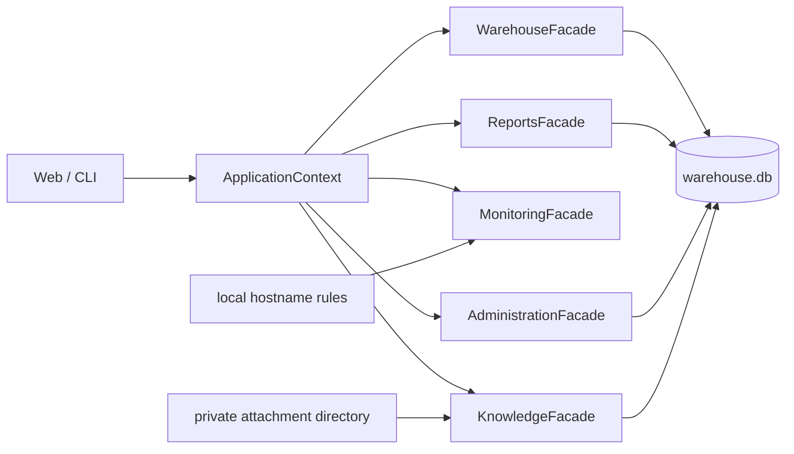

# ODE — локальный рабочий склад

## ODE 0.14.0: сначала фактическая инвентаризация

Текущие 50 000 карточек и движения сохранены как **история**. Остаток,
полученный как «исторические приходы минус исторические расходы», не считается
фактическим наличием. До утверждённой полной инвентаризации Warehouse работает
в состоянии `NOT_INITIALIZED`: просмотр, поиск, Timeline, диагностика и backup
доступны, а реальные приход/расход/scanner/transfer mutations блокируются.

Экран `Склад → Инвентаризация` предоставляет безопасный workflow:

1. скачать строгий XLSX-шаблон и создать FULL session;
2. загрузить text-only XLSX во внешний workspace;
3. построить Preview без записи в `data/warehouse.db`;
4. исправить или явно классифицировать блокирующие строки и повторить проверку;
5. после `READY_FOR_APPROVAL` администратор может собрать отдельный disposable
   baseline-кандидат на approved target schema V001..V008.

Candidate rehearsal создаёт snapshot и projection в отдельном файле, проверяет
schema hash, integrity, FK и domain invariants. Автоматическая публикация в
рабочую БД отключена (`publish_available=false`). Инструкция:
[FULL Inventory 0.14](docs/MANUAL_TESTING_0_14_FULL_INVENTORY.md).

Preview читает Inventory rows потоково. Проверенный disposable benchmark для
50 000 строк: около 6.45 секунды, 7 755 строк/с и 69 MiB peak RSS отдельного
Preview-процесса. Повторные клики и stale requests не создают параллельный run,
а source/candidate paths проверяются по SHA-256 и на отсутствие symlink.

## Warehouse Stabilization (2026-07-14)

Активно развивается и принимается только модуль **Склад**. Обычный запуск —
`python3 app.py`; он использует `data/warehouse.db`. Monitoring теперь имеет
изолированный ручной поиск по hostname, безопасную маршрутизацию адресатов и
опциональный DCIM collector через Microsoft Edge. База знаний хранит инструкции,
спецификации, теги и вложения. Эти модули не используют складские workflow;
Reports остаётся отдельным контуром.

Клик по ODE открывает карточки модулей. После выбора Склада доступны только
Карточки оборудования, Приход, Расход, Инвентаризация, Поставки, Перемещения и
Справочники. `Администрирование ODE` показывается только пользователю с
backend-ролью admin; имя или фамилия никогда не дают права. Карточка `Профиль`
на Главной — единственная точка входа в личные данные и смену пароля; top bar
не дублирует её отдельными кнопками.

Формы получают canonical значения через существующий Reference API и
`WarehouseFacade` из `reference_domains_v2`, `reference_values_v2` и
`reference_aliases_v2`. Не добавляйте варианты в JavaScript. В редакторе
`Администрирование ODE → Управление справочниками` новое значение сначала
создаётся как pending, удаление означает deactivate, а merge требует preview.
Модели фильтруются по выбранному вендору.

Черновики прихода/расхода изолированы по пользователю и fingerprint БД, имеют
schema version и TTL 14 дней. ODE не восстанавливает шаг автоматически:
пользователь выбирает продолжить, начать заново или удалить черновик. До
confirm можно удалить одну/выбранные/все строки и повторно добавить S/N.

Глобальный поиск начинается с двух символов, выполняется на backend с limit,
debounce/cancellation и открывает обычную Equipment Card. Он не загружает
50 000 строк в браузер. Перед ручной приёмкой используйте
[`docs/MANUAL_TESTING_WAREHOUSE_STABILIZATION.md`](docs/MANUAL_TESTING_WAREHOUSE_STABILIZATION.md).

С 2026-07-14 единственная обычная локальная рабочая БД ODE —
`data/warehouse.db`. Команда `python3 app.py` без migration-переменных и
специальных launcher'ов всегда открывает именно её. В неё атомарно опубликована
проверенная полная складская база: 50 000 карточек, 50 000 состояний прихода,
18 798 расходов и 18 798 allocations. Старое тестовое содержимое в рабочую БД
не переносилось. Баланс и карточки читаются существующим `WarehouseFacade` из
`stock_receipts`, `stock_issues` и `stock_issue_allocations`.

Исходный `migration_inputs/workspace/warehouse_full_candidate.db`, pilot и raw
sources остаются отдельными immutable/генерируемыми артефактами и не
редактируются вручную. Технический migration review доступен только как
административная диагностика; обычный старт открывает стандартную главную
страницу без candidate/read-only contour. Процедуры запуска, backup и rollback
описаны в [локальном runbook](docs/LOCAL_WORKING_DATABASE_RUNBOOK.md), а
история построения candidate — в
[FULL_WAREHOUSE_MIGRATION.md](docs/FULL_WAREHOUSE_MIGRATION.md).

Это локальная promotion, а не серверный production deployment. Runtime
metadata исходников синхронизирована на `0.14.0`, но последний фактически
собранный Windows ZIP по-прежнему содержит `ODE 0.12.17 RC1`. Builder 0.14
формирует source package без runtime DB; новый Windows artifact этой работой
не создавался.

В исходном репозитории UI smoke-test запускается командой
`python3 scripts/smoke_ui.py`. Для него нужны Node.js и Google Chrome в
стандартной папке macOS. Тест использует временную копию БД и гарантированно
завершает локальный сервер и headless Chrome. UI/unit-тесты, MCP-бинарник и его
cache в рабочий Windows-архив не входят; безопасный генератор тестовой БД и
отдельные test launcher'ы являются support-инструментами исходного проекта.

Локальный рабочий инструмент отдела дежурных инженеров для складского учета, логов работ и сменной отчетности ЦОД Ixcellerate. Приложение работает на Python и SQLite без подключения к интернету и внешних Python-библиотек.

Основной интерфейс открывается в браузере только на локальном компьютере. Рабочая база находится в `data/warehouse.db`.

Актуальное состояние ODE описывают этот файл, [CHANGELOG.md](CHANGELOG.md),
[карта связей кода](docs/CODEBASE_GRAPH.md),
[контракт hostname routing](docs/MONITORING_HOSTNAME_ROUTING.md),
[архитектура массового назначения Inventory Number](docs/INVENTORY_NUMBER_IMPORT_ARCHITECTURE.md),
[reference-data architecture](docs/REFERENCE_DATA_ARCHITECTURE.md),
[S/N preservation contract](docs/SERIAL_NUMBER_PRESERVATION.md),
[migration staging architecture](docs/MIGRATION_STAGING_ARCHITECTURE.md),
[pilot architecture](docs/MIGRATION_PILOT_ARCHITECTURE.md),
[pilot review guide](docs/MIGRATION_PILOT_REVIEW_GUIDE.md),
[full historical candidate guide](docs/FULL_WAREHOUSE_MIGRATION.md),
[Monitoring and Knowledge guide](docs/MONITORING_KNOWLEDGE_GUIDE.md),
[ARCHITECTURE.md](ARCHITECTURE.md),
[Release Review Stage 0.13.2](RELEASE_REPORT_ODE_0_13_2.md) и
[индекс технической документации](docs/README.md). Старые QA/review/release-
файлы являются датированными историческими снимками своих версий.

## Рабочая инструкция

После входа открывается Главная с рабочими разделами `Склад`, `Работы`,
`Мониторинг`, `База знаний`, `Отчеты` и `Профиль`; административная карточка
видна только администратору. Кнопка-лупа в компактной шапке открывает поиск по S/N,
инвентарному номеру, hostname, наименованию, типу, вендору, модели, поставке,
заказу, проекту, полке, ЦОД и инженеру. Кнопка `ODE` всегда возвращает на
Главную. Основная работа выполняется в разделе `Склад`:

1. `Баланс` — найдите позицию по S/N, инвентарному номеру, наименованию, модели, вендору, проекту или полке. Из строки можно открыть карточку или начать списание. Начальная выдача ограничена 5 000 позициями; поиск выполняется по всей БД и показывает до 500 совпадений. Полная отфильтрованная выборка доступна по кнопке `Скачать баланс`.
2. `Приход` — заполните общие поля и сканируйте S/N либо оформите одну позицию формой. До подтверждения строку можно удалить отдельно, выбранной группой или очистить весь временный список; удаление сразу сохраняется в browser draft. Для большой поставки можно загрузить CSV: строки сначала проверяются и записываются только после подтверждения.
3. `Расход` — заполните задачу и сканируйте S/N либо найдите позицию, нажмите `Списать` и подтвердите операцию. Ошибочно отсканированный S/N удаляется только из временного списка и не меняет баланс/аллокации. Неизвестные S/N, оставленные в списке и подтвержденные, сохраняются как проблемные строки.
4. `Инвентаризация` содержит два разных сценария. Старый список S/N сравнивает
   фактическое наличие со складом и ничего не записывает. Новый блок
   `Массовое назначение Inventory Number` принимает пары `Serial Number` и
   `Inventory Number`, выполняет read-only Preview, показывает построчные
   статусы и изменяет только строки `SUCCESS` после отдельного Confirm. Запись
   доступна `engineer/admin`; `viewer` остаётся read-only.
5. `Проблемы` и `События` — контроль качества данных и хронология складских операций.
6. `Карточка оборудования` — открывается из глобального поиска или баланса и
   показывает реквизиты, текущий остаток, размещение, поставку, ответственного
   и полную доступную историю. Если у существующей S/N-позиции номер пуст,
   `engineer/admin` может назначить Inventory Number; другой заполненный номер
   не перезаписывается.

В разделе `Поставки` загружается документ снабжения, проверяются дубли и уже принятые S/N, заполняются недостающие поля и выполняется приемка сканером. В разделе `Отчеты` формируются ежедневный и еженедельный отчеты и ведутся логи работ. Экран `Мониторинг` выполняет ручной поиск по hostname, собирает доступные DCIM-сведения и готовит Rooms/email-текст, но не отправляет письмо автоматически. `База знаний` поддерживает поиск, теги, пагинацию, безопасный Markdown и вложения; изменять статьи могут `engineer/admin`.

## Карта связей

GitHub отображает эту поддерживаемую архитектурную диаграмму без публикации
локального Codebase Memory cache:



Подробная схема и границы интерактивного локального графа:
[docs/CODEBASE_GRAPH.md](docs/CODEBASE_GRAPH.md).

Перед массовой загрузкой создайте резервную копию в `Администрирование → Резервные копии`. Справочники работают как подсказки: пользователь может вводить новые текстовые значения, а программа добавит их в список. Обычная проверка файла исправляет допустимые различия форматов и принимает «грязные» CSV; строгая проверка нужна только для дополнительного контроля.

## Реализованные этапы

### Срочная подготовка к реальным данным

- справочники являются подсказками, не блокируют свободный ввод и автоматически пополняются;
- обычная проверка CSV включена по умолчанию и терпимо обрабатывает различия форматов;
- приход, расход и логи поддерживают до 40 000 строк;
- предпросмотр показывает первые 100 строк, общую статистику и первые 200 ошибок;
- даты принимаются как `YYYY-MM-DD`, `DD.MM.YYYY` и `DD/MM/YYYY`;
- поддерживаются русские и английские синонимы основных заголовков;
- несопоставленный расход сохраняется отдельно от аллокаций и не ломает баланс;
- добавлены контроль качества данных, недельные проблемные строки и инвентаризация по S/N;
- подтвержденная загрузка выполняется одной SQLite-транзакцией с полным откатом при ошибке;
- добавлены приемка и списание USB/Bluetooth-сканером, работающим как клавиатура;
- реализован реестр поставок с проверкой файла, построчной приемкой, внеплановыми позициями и закрытием поставки.

### Stage 1 — структура приложения, логи и отчеты

- навигация «Склад / Отчеты / Мониторинг»;
- сохранение текущих складских функций;
- ручное добавление и просмотр логов работ;
- источники, типы и номера задач хранятся отдельно;
- отображение полного номера задачи, например `ПНР-123`;
- фильтр логов по периоду;
- атомарный импорт и экспорт логов в CSV;
- ежедневный отчет в порядке: логи работ, приход, расход;
- заглушки Kaiten, еженедельного отчета и мониторинга.

### Stage 2 — рабочая модель прихода и расхода

- расширенный приход с заказом, PLU, проектом, поставщиком, вендором и классификацией;
- отдельные типы оборудования, компонентов и кабелей;
- оборудование и компоненты учитываются в штуках и списываются по S/N;
- для оборудования и компонентов обязательна задача;
- компонент списывается на целевое оборудование;
- запрещено списывать оборудование само на себя;
- кабели могут не иметь S/N, проекта, задачи и целевого оборудования;
- кабели списываются по наименованию и типу, единица учета — метры;
- расход кабеля распределяется по подходящим партиям FIFO;
- проект и остальные реквизиты расхода подтягиваются из прихода;
- редактируемые справочники хранятся в БД, значения можно отключать без удаления;
- импорт прихода, расхода и логов атомарный, с указанием ошибочной строки;
- поддерживаются UTF-8 BOM и Windows-1251;
- существующие остатки перенесены в новую модель как начальные позиции.

### Stage 3 — новый баланс и показатели

- баланс рассчитывается только как `stock_receipts − stock_issue_allocations`;
- старые `equipment/operations` не используются для баланса, обзора и ежедневного отчета;
- одинаковые позиции на разных полках агрегируются без включения полки в ключ расчета;
- полки выводятся справочно и не влияют на остаток;
- фильтры по проекту, объекту, типу оборудования, типу компонента, типу кабеля, единице учета и ЦОД;
- экспорт нового баланса в Excel-совместимый CSV;
- обзор склада считает приход, расход, баланс и позиции по новой модели;
- ежедневный отчет использует новые приходы и расходы;
- старые данные сохранены через начальные позиции и `legacy_equipment_id`.

### Stage 4.1 — эксплуатационная надежность без ролей

- создание согласованного SQLite backup из интерфейса;
- имена backup-файлов содержат дату и время;
- просмотр списка копий из `data/backups`;
- `PRAGMA integrity_check` и проверка ключевых таблиц;
- восстановление только после явного подтверждения;
- автоматический страховочный backup перед восстановлением;
- автоматическая проверка выбранной и восстановленной базы;
- единый `audit_log` для прихода, расхода, логов, справочников, backup, restore и проверки базы;
- автор операций Stage 4.1 фиксируется как `local_user`;
- вкладка «Администрирование».

### Stage 4.2 — пользователи, безопасная БД и готовые отчеты

- локальные профили и роли `admin`, `engineer`, `viewer`;
- вход по email и паролю; пароль хранится как PBKDF2-SHA256 с солью;
- смена пароля и рекомендация сменить начальный пароль;
- реальный email автора в `audit_log`;
- admin-only backup, restore, аудит, пользователи и загрузка `.db` в прод;
- страховочный backup, миграция, `integrity_check` и откат при замене базы;
- группировка, фильтрация, сортировка и включение/отключение справочников;
- свободный тестовый режим справочных полей прихода/расхода с автосбором значений;
- отдельное хранение готовых ежедневных CSV-отчетов без записи в `work_logs`;
- бренд ODE — «Отдел дежурных инженеров», разделы привязаны к настройке текущего ЦОД;
- первоначальная заглушка учета поставок (в текущей версии заменена рабочим разделом `Поставки`).

### Stage 4.3 — отказ от Excel как основной логики

- основная работа выполняется в ODE: приход, поиск позиции, списание и автоматический баланс;
- CSV используется как скан-лист для больших партий и списков S/N, а не как основная таблица учета;
- приход и расход из CSV сначала проходят preview без записи и аудита;
- preview показывает статистику, первые 100 строк и до 200 ошибок с номерами строк;
- подтверждение доступно только для полностью валидного файла и выполняется одной транзакцией;
- из баланса открывается карточка позиции с реквизитами, остатком, движениями, аллокациями и связанным аудитом;
- общий поиск работает по S/N, инвентарному номеру, наименованию, модели, вендору, проекту, объекту и полке;
- расход можно начать из поиска или непосредственно из строки баланса;
- строгий массовый расход списывает одной транзакцией список S/N оборудования/компонентов;
- добавлена базовая недельная агрегация с разбивкой по проектам и типам и экспортом CSV.

Подробная история изменений находится в [CHANGELOG.md](CHANGELOG.md).

### Stage 5 — рабочий интерфейс инженера

- добавлен стартовый экран с быстрыми действиями «Принять», «Списать», «Найти» и «Инвентаризация»;
- формы прихода и расхода разделены на понятные сценарии: ручной ввод, сканер и загрузка CSV;
- обычный вход запрашивает ФИО инженера и записывает его как автора операций;
- административный вход с email и паролем вынесен в отдельный режим;
- в профиле можно изменить ФИО и должность, email остается идентификатором учетной записи;
- ежедневный отчет позволяет сохранить несколько строк работ одной атомарной операцией;
- категория прихода автоматически сопоставляется с типом оборудования, компонента или кабеля;
- кабель можно принять без серийного номера, для оборудования и компонентов S/N остается обязательным;
- ошибки загрузки интерфейса показываются на странице и не оставляют пустой экран.

### Stage 0.12.17 — product hardening

- добавлены Dashboard, постоянная верхняя навигация и глобальный поиск;
- карточка оборудования стала центральным экраном реквизитов и истории;
- `Проблемы` и `События` перенесены в `Склад`, Monitoring оставлен заглушкой;
- баланс, поставки, inventory DOM, история и bootstrap получили серверные лимиты;
- точные проверки S/N и инвентарных номеров используют partial indexes;
- preview ограничены по owner/session согласно своему flow, по памяти и TTL;
- инженерная сессия принудительно понижается до роли `engineer` в сервисном контексте;
- admin login получил rate limit, сессии — TTL, а начальный пароль блокирует admin-действия до смены;
- добавлены Host/Origin checks, security headers, строгая JSON-валидация и защита CSV от формул;
- браузерный smoke проверяет desktop/mobile, Back/reload, глобальный поиск, admin API и отсутствие HTTP/JS/resource errors.

### ODE 0.12.17.1 RC2 — compact shell и безопасный scanner draft

- Главная показывает четыре карточки модулей; Monitoring остается отдельной
  заглушкой без складских «Проблем» и «Событий».
- Глобальный поиск перенесен в modal с автофокусом и клавиатурной навигацией.
- Scanner draft прихода/расхода поддерживает одиночное, выбранное и полное
  удаление до confirm, синхронно обновляя DOM, счетчик, payload и localStorage.
- Повторный S/N в текущем draft не добавляется; после удаления его можно
  отсканировать снова.
- Добавлен безопасный генератор empty/demo test DB и отдельные test launchers
  с заметным баннером «ТЕСТОВЫЙ КОНТУР».

### ODE 0.13.1 — Inventory Number в карточке

- существующая S/N-карточка получила безопасное заполнение пустого Inventory
  Number без создания новой позиции и без overwrite;
- связанная legacy-карточка синхронизируется в той же транзакции;
- реальный update создаёт `EQUIPMENT_INVENTORY_NUMBER_ASSIGNED` в audit и
  отображается в Timeline.

### ODE 0.13.2 — массовое назначение Inventory Number

- обязательны столбцы Serial Number и Inventory Number; при назначении
  используются только они, а сопоставление выполняется исключительно по S/N;
- Preview не изменяет БД и показывает `SUCCESS`, `UNCHANGED`, `NOT_FOUND`,
  `ALREADY_ASSIGNED`, `DUPLICATE_INVENTORY_NUMBER`, `VALIDATION_ERROR`;
- повтор S/N внутри CSV блокирует Confirm, а допустимые строки применяются
  после повторной проверки одной транзакцией;
- повторный импорт становится `UNCHANGED`; каждая реально изменённая позиция
  получает собственную audit/Timeline-запись;
- схема БД не менялась. Полный технический контракт —
  [в отдельном документе](docs/INVENTORY_NUMBER_IMPORT_ARCHITECTURE.md).

### ODE 0.13.3A — reference foundation и migration staging

**IMPLEMENTED:** в `inventory/migration/` создан offline-слой,
который не подключён к HTTP/UI и не пишет в рабочую БД. Он:

- извлекает XLSX S/N вместе с raw XML token, cell type, number
  format и source coordinate;
- хранит `source_serial_value` отдельно от
  `normalized_match_value`; NFKC/casefold/outer trim применяются
  только к match key;
- не строит match key ни для одной numeric S/N ячейки до ручного
  решения; exponent notation остаётся literal raw token;
- формирует candidate-справочники, aliases и canonical names из
  структурированных полей;
- создаёт ignored disposable candidate DB и валидирует её
  schema, foreign keys, content и security boundary.

Проверенный review snapshot содержит 71 360 staging rows и 91 717
S/N-role cells. В candidate package находятся 893 reference values,
916 aliases (`517 AUTO_APPROVED`, `399 PENDING`) и 358 catalog-item
proposals; production operational tables остаются пустыми.

Основной developer entrypoint —
`scripts/migration_reference_data.py`; он умеет инспектировать
sources, собирать candidate, валидировать его и выводить
secret-free report. Report path проходит полный inode/path guard, а JSON
строится заново из allowlisted candidate/source facts без merge старого файла.
Это не runtime `inventory/cli.py` и не HTTP API.

**FACT:** production `reference_values(kind, name, is_active)` и текущий
receipt UI пока остаются прежними. Unknown production values в soft
mode всё ещё могут создавать плоские references; candidate-слой
этого не меняет.

**FUTURE STAGE:** dependent receipt selectors, production reference integration,
импорт прихода/расхода и замена `data/warehouse.db`. Ни одно из
этих действий в Stage 0.13.3A не выполняется.

Подробные contracts:
[reference domains](docs/REFERENCE_DATA_ARCHITECTURE.md),
[canonical names](docs/CANONICAL_NAMING.md),
[serial preservation](docs/SERIAL_NUMBER_PRESERVATION.md),
[staging](docs/MIGRATION_STAGING_ARCHITECTURE.md) и
[future reset plan](docs/MIGRATION_DATABASE_RESET_PLAN.md).

### ODE 0.13.3A.5 — preservation-aware migration pilot

**IMPLEMENTED / PILOT ONLY:** отдельный selector с фиксированным seed
`ODE-0.13.3A.5-PILOT-v1` выбирает ровно 200 реальных строк прихода из staging.
В pilot selection входят ordinary text, leading-zero и long S/N, servers,
components, разные vendors, duplicate/conflict groups, numeric/manual-review,
все receipt-side `SOURCE_CORRUPTED`, missing/multiple shelf и quantity-like
позиции. Каждая строка имеет причину выбора и одно решение.

130 строк `IMPORT` создают по одной карточке на preserved S/N только в
`migration_inputs/workspace/warehouse_pilot_candidate.db`. Остальные решения
(`QUARANTINE`, `MANUAL_REVIEW`, `EXACT_DUPLICATE`,
`CONFLICT_HISTORY_ONLY`, `QUANTITY_POSITION_DEFERRED`,
`SOURCE_CORRUPTED_REJECTED`) сохраняют provenance и не создают вторую/ложную
карточку. Source S/N записывается без `strip`, upper-case, числового conversion
или изменения внутренних символов; match key используется только для поиска.

**FACT FROM SOURCE:** Vegman R220 присутствует, Vegman R200 в утверждённых
источниках отсутствует. Pilot не синтезирует R200; правило раздельности моделей
проверяется unit test.

Для ручной проверки есть marker-guarded UI с баннером
`МИГРАЦИОННЫЙ ПИЛОТ`, фильтрами решений и migration section в Equipment Card.
Он запускается только отдельными launcher'ами и только на DB с точным marker;
operational POST mutations запрещены backend.

```bash
./start_migration_pilot_macos.command
```

Windows: `start_migration_pilot_windows.bat`. Launcher не создаёт и не
перезаписывает DB. Перед запуском pilot DB должна быть собрана и проверена
отдельным `scripts/migration_pilot.py`; см.
[review guide](docs/MIGRATION_PILOT_REVIEW_GUIDE.md).
После marker-check pilot startup отключает обычную инициализацию схемы сервиса;
headless smoke отдельно подтверждает неизменный SHA временной pilot DB copy.

**NOT PRODUCTION:** pilot approval не разрешает копировать DB
в `data`, выполнять reset или массово загружать 51 003 receipt rows.

### Full Historical Warehouse Candidate

**HISTORICAL BUILD ARTIFACT / PROMOTED LOCALLY:** отдельный
`warehouse_full_candidate.db` обработал 71 360 source rows и был построен из
operationally-empty Stage A candidate. Он содержит 50 000 identity/card states,
18 798 historical issues, 291 explicit opening states, 6 689 provisional numeric
identities и 4 quarantine rows. Каждая source row присутствует в reconciliation
и full XLSX report с финальным статусом.

```bash
python3 scripts/migration_full_candidate.py build --overwrite
python3 scripts/migration_full_candidate.py validate
./start_full_migration_candidate_macos.command
```

Windows launcher: `start_full_migration_candidate_windows.bat`. Launcher ничего
не пересобирает, проверяет `FULL_WAREHOUSE_CANDIDATE` и никогда не выбирает
`data/warehouse.db`. Обычный runtime не открывает файл с candidate-именем;
локальная рабочая БД была получена только проверенной byte-copy в sibling
`.next` и атомарным `os.replace`. Полный build/report/identity/clean-contour
contract и
ограничения описаны в
[docs/FULL_WAREHOUSE_MIGRATION.md](docs/FULL_WAREHOUSE_MIGRATION.md).

## Текущая архитектура

```text
app.py
  ├─ inventory/webapp.py       HTTP UI и API
  └─ inventory/cli.py          совместимый CLI
             │
             ▼
     inventory/core/          контекст приложения и контракты событий
     inventory/warehouse/     склад, поставки, приемка и списание
     inventory/reports/       отчеты и логи работ
     inventory/administration/пользователи, аудит и резервные копии
     inventory/monitoring/    граница будущего модуля мониторинга
     inventory/migration/     offline extraction/reference/staging/full candidate
             │
             ▼
     inventory/shared/        общие адаптеры SQLite, CSV и валидации
     inventory/db.py          схема и миграции
             │
             ▼
     data/warehouse.db        локальная SQLite-база
```

Основной рабочий путь — браузерный интерфейс. `inventory/service.py` остается
слоем совместимости для еще не перенесенных сценариев; новая логика входит через
публичные фасады профильных модулей. CLI сохранен для совместимости со старой
моделью.

Основные файлы:

```text
app.py                     точка запуска
inventory/db.py            схема SQLite и идемпотентные миграции
inventory/service.py       compatibility facade для оставшихся legacy flows
inventory/importing.py     кодировки, разделители и синонимы CSV-заголовков
inventory/webapp.py        локальный интерфейс и HTTP API
inventory/cli.py           совместимый CLI
inventory/seed.py          демонстрационное наполнение
inventory/migration/       candidate-only reference, S/N и staging modules
inventory/warehouse/       целевые warehouse services/repositories/facade
static/js/warehouse/       модульный frontend склада
tests/                     unit, contract, API и frontend тесты
data/warehouse.db          рабочая база
migration_inputs/workspace/ignored disposable candidate artifacts
start_*migration*           marker-guarded read-only pilot/full launchers
```

## Текущие таблицы

| Таблица | Назначение |
|---|---|
| `stock_receipts` | Партии прихода и начальные остатки; реквизиты, классификация, полка, единица и ЦОД |
| `stock_issues` | Операции расхода, задача, исполнитель и целевое оборудование |
| `stock_issue_allocations` | Распределение расхода по партиям прихода; основа расчета баланса |
| `reference_values` | Наименования, модели, места, ЦОД, проекты, объекты, типы, контрагенты, единицы и справочники задач |
| `work_logs` | Логи выполненных работ |
| `audit_log` | Единый аудит действий, backup, restore и проверок целостности |
| `users` | Локальные профили, роли и хеши паролей |
| `daily_report_uploads` | Реестр загруженных готовых ежедневных отчетов |
| `daily_report_rows` | Строки готовых отчетов, изолированные от `work_logs` |
| `deliveries` | Загруженные поставки, их источник, поставщик и состояние приемки |
| `delivery_lines` | Строки поставки, результаты проверки и связь с созданным приходом |
| `equipment` | Старая модель карточек, сохраненная для совместимости CLI |
| `operations` | Старый журнал складских операций |
| `categories` | Старый справочник категорий |
| `locations` | Старый справочник мест хранения |

Новые складские функции должны развиваться через `stock_receipts`, `stock_issues` и `stock_issue_allocations`, а не через старые таблицы.

## Запуск

Требования:

- Python 3.10 или новее;
- Windows, macOS или Linux;
- свободный локальный порт `8765`;
- внешние пакеты не требуются.

Из корня проекта:

```bash
python3 app.py
```

Интерфейс откроется по адресу `http://127.0.0.1:8765`.

В консоли normal startup печатает `WORKING DATABASE`, абсолютный путь,
версию ODE, число карточек и результат `integrity_check`. Для обычной работы
не задавайте `ODE_FULL_MIGRATION_CANDIDATE` и не используйте migration
launcher.

При первом запуске пустой базы создается администратор:

- email: `lokolis`;
- пароль: `lokolis`;
- Александр Мерненко, «Администратор / дежурный инженер»;
- роль: `admin`.

Пароль в БД хранится только как хеш. На новой базе сервер разрешает начальному
администратору только смену пароля; остальные административные операции
заблокированы до задания нового пароля в разделе `Профиль`. Если пользователь
`lokolis` уже существует, приложение не пересоздает его и не сбрасывает пароль.

На Windows:

```bat
py app.py
```

Также доступны `start_macos.command` и `start_windows.bat`.

### Перенос на рабочий ноутбук

1. Остановите ODE на исходном компьютере.
2. Используйте только заранее проверенный архив с явно указанной версией.
   Текущий source Stage 0.13.3A нельзя собирать/публиковать старым
   `build_windows_package.py`: его metadata и embedded notes пока закреплены за
   RC2. Новый ZIP требует отдельного version/release change и Windows sign-off.
3. На рабочем ноутбуке установите Python 3.10+ и дважды щелкните `start_windows.bat`.
4. Войдите существующей учетной записью: перенос базы сохраняет пользователей, роли и пароль.
5. Перед первой реальной загрузкой создайте резервную копию во вкладке «Администрирование».
6. Проверяйте файл до подтверждения и просматривайте проблемные списания после загрузки.

Не запускайте `seed --reset` на перенесенной рабочей базе.

Другая база или порт:

```bash
python3 app.py gui --db data/warehouse_test.db --port 8876
```

Консольный режим:

```bash
python3 app.py --help
python3 app.py menu
```

Важно: команда ниже удаляет выбранную базу и создает демонстрационные данные. Не запускайте ее для рабочей базы без проверенного backup:

```bash
python3 app.py seed --reset
```

## Резервные копии и восстановление

Основной способ — раздел `Администрирование`, доступный только `admin`:

- «Создать резервную копию» формирует проверенную копию в `data/backups`;
- «Проверить базу» запускает `PRAGMA integrity_check` и проверку таблиц;
- список резервных копий показывает имя, время и размер;
- восстановление требует подтверждения и автоматически сохраняет текущее состояние.
- «Загрузить базу» принимает `.db`, предварительно создает резервную копию, проверяет новый файл и при ошибке возвращает прежнюю базу.

Во время backup и restore веб-запросы к базе сериализуются. Не закрывайте приложение до получения сообщения о завершении.

Перед файловыми операциями остановите ODE и убедитесь, что нет writer-процесса
и SQLite sidecar-файлов. Не выполняйте обычный `cp`/`copy` поверх открытой
`data/warehouse.db`. Для внешней страхующей копии сохраняйте одновременно
byte-copy остановленной БД и независимый SQLite `.backup`, проверяйте обе
через SHA-256, `integrity_check`, `foreign_key_check` и row counts. Точная
процедура — в
[docs/LOCAL_WORKING_DATABASE_RUNBOOK.md](docs/LOCAL_WORKING_DATABASE_RUNBOOK.md).

Рекомендуемый регламент:

- backup перед обновлением, миграцией и массовым импортом;
- ежедневный backup в рабочие дни;
- хранение нескольких поколений копий вне каталога приложения;
- периодическая проверка копии запуском ODE с параметром `--db`;
- восстановление сначала проверять на отдельном пути.

Проверка backup без замены рабочей базы:

```bash
python3 app.py gui --db data/backups/warehouse_YYYYMMDD_HHMMSS.db --port 8876
```

Для восстановления остановите приложение, проверьте backup, подготовьте
`data/warehouse.db.next` на том же файловом разделе и опубликуйте его атомарным
rename/`os.replace`. Не перезаписывайте открытую SQLite-БД.

## CSV

Шаблоны прихода, расхода, логов и готового ежедневного отчета скачиваются из соответствующих вкладок. Все пользовательские шаблоны и выгрузки используют точку с запятой и UTF-8 BOM, поэтому Excel для macOS и Windows с русской локалью открывает их по отдельным колонкам. Выгрузка текущего проверенного файла содержит только его строки, а кнопки полной выгрузки явно подписаны как весь приход, расход или баланс.

ODE при импорте принимает оба разделителя: `,` и `;`.

Для прихода и расхода загрузка теперь состоит из двух явных шагов:

1. выбрать CSV и проверить статистику, первые 100 строк и список ошибок;
2. нажать «Подтвердить загрузку», если ошибок нет.

Предпросмотр файла не меняет склад и не создает запись в журнале действий. Перед подтверждением ODE повторяет проверку, поэтому изменение остатка между просмотром и подтверждением не приведет к некорректному списанию.

### Массовое назначение Inventory Number

В `Склад -> Инвентаризация` скачайте отдельный шаблон с двумя обязательными
столбцами: `Serial Number` и `Inventory Number`. Загрузите заполненный CSV,
проверьте Preview и только затем нажмите `Подтвердить импорт`.

- `SUCCESS` — номер будет назначен существующей S/N-позиции;
- `UNCHANGED` — тот же номер уже записан;
- `NOT_FOUND` — S/N отсутствует, новая карточка не создаётся;
- `ALREADY_ASSIGNED` — у позиции уже другой номер;
- `DUPLICATE_INVENTORY_NUMBER` — номер принадлежит другой позиции либо
  повторяется в плане;
- `VALIDATION_ERROR` — ошибка обязательного поля или повтор S/N внутри CSV;
  Confirm всего preview недоступен.

Таблицы Preview и Result показывают первые 100 строк, а counters относятся ко
всему файлу. Отдельная подсказка об этом усечении в текущем UI отсутствует.
Конфликтные строки не изменяются; все строки `SUCCESS` повторно
проверяются и записываются одной транзакцией. После ошибки/stale preview нужен
новый Preview. Повторная загрузка уже применённого файла показывает
`UNCHANGED` и не создаёт второй Timeline event. Подробный CSV/API/transaction-
контракт находится в
[docs/INVENTORY_NUMBER_IMPORT_ARCHITECTURE.md](docs/INVENTORY_NUMBER_IMPORT_ARCHITECTURE.md).

Для массового списания скачайте шаблон `S/N;Комментарий`, отсканируйте S/N и заполните общие дату, ФИО и задачу. Неизвестный, повторный, кабельный или уже списанный S/N блокирует весь файл. Если в списке есть компонент, укажите целевой S/N.

## Сканер и поставки

Подходит любой USB- или Bluetooth-сканер, который вводит значение как клавиатура и завершает его клавишей Enter. Специальный драйвер и интеграция с оборудованием не требуются.

- в `Приходе` общие поля применяются ко всему списку; повторный или уже существующий S/N не добавляется;
- в `Расходе` найденные позиции проверяются до подтверждения, а неизвестные S/N сохраняются в проблемных строках;
- все позиции списка проводятся одной транзакцией: при ошибке подтверждения изменения откатываются;
- в `Поставках` CSV сначала показывается в preview: новые S/N будут приняты, а у уже существующих позиций заполнятся только пустые реквизиты; неизвестные столбцы показываются отдельно;
- закрытая поставка больше не принимает позиции; результат доступен для выгрузки в CSV.

Карточка позиции открывается кнопкой «Открыть» в балансе. Кнопка «Списать» переносит выбранную позицию в форму расхода и заполняет S/N либо кабельный ключ и доступный остаток.

В приходе и расходе справочные поля принимают свободный текст. Существующие справочники используются как подсказки, а новые непустые значения автоматически добавляются как активные. Строгий режим можно включить при создании сервиса: `WarehouseService(db_path, strict_reference_validation=True)`; значение по умолчанию — `False`.

- максимальный размер файла — 50 МБ;
- не более 40 000 непустых строк в одном файле; файл на 100 000 строк будет отклонен с явной ошибкой и должен быть разделен;
- поддерживаются разделители `;` и `,`;
- поддерживаются UTF-8 BOM и Windows-1251;
- даты принимаются в форматах `YYYY-MM-DD` и `DD.MM.YYYY` и сохраняются в базе как `YYYY-MM-DD`;
- столбец количества в шаблоне и выгрузке прихода называется `Кол-во` (старый заголовок `Кол-во / метраж` также принимается при импорте);
- файл импортируется одной транзакцией;
- при ошибке не записывается ни одна строка;
- сообщение содержит строку и причину ошибки.

Готовый ежедневный отчет хранится в `daily_report_uploads` / `daily_report_rows`, отображается и экспортируется отдельно. Он не добавляет строки в `work_logs` и не меняет генерацию отчета из базы.

## Тестирование

```bash
python3 -m unittest discover -s tests -v
```

Полный discover-набор текущего source содержит **464 теста**. Исторические
составы gate по отдельным Stage сохранены в датированных CHANGELOG/manual QA и
не используются как текущий счётчик. Набор включает CSV и шаблоны,
сканирование, поставки, карточки, глобальный поиск, массовое назначение
Inventory Number, атомарный rollback, отчеты, справочники, баланс,
пользователей, роли, сессии, безопасность, резервные копии, аудит,
S/N-preservation, disposable migration candidates, selector, exact pilot
writer, marker/security/API/UI/launcher contracts, pilot/full Timeline,
clean-contour и full XLSX checks.

Полная проверка основного пользовательского маршрута в headless Chrome (macOS):

```bash
python3 scripts/smoke_ui.py
```

Full candidate review smoke (temporary DB copy, read-only SHA proof):

```bash
python3 scripts/smoke_migration_full_ui.py
```

## Ограничения

- SQLite не рассчитана на активную многопользовательскую запись;
- backup и восстановление доступны из интерфейса, но нет автоматического расписания и внешней ротации копий;
- прямое редактирование SQLite-файла не защищено аудитом;
- нет корректирующих/сторнирующих операций для ошибочно проведенного прихода или расхода;
- Monitoring не отправляет письма автоматически; живой DCIM-сбор требует
  Selenium, Microsoft Edge, отдельный профиль и действующую DCIM-сессию.
  Kaiten остаётся заглушкой, недельный отчёт — базовой агрегацией без
  отдельного конструктора;
- Knowledge использует параметризованный `LIKE`, а не FTS5; при большом объёме
  статей потребуется полнотекстовый индекс и отдельная retention-политика для
  вложений мягко удалённых статей;
- сканер поддерживается только в режиме клавиатуры; генерации этикеток и управления устройством нет;
- нет уведомлений о минимальном остатке;
- preview массового назначения хранится только в памяти процесса, живёт до
  одного часа и после consume/restart/eviction требует повторной загрузки;
- отдельного persisted batch ID, batch audit-event и фонового progress для
  Inventory Number CSV нет;
- Stage 0.13.2/0.13.3A/0.13.3A.5/full candidate не собраны в Windows ZIP;
  pilot и full DB остаются local-only review artifacts, а production
  replacement требует отдельного решения после ручной проверки;
- текущий `COLLATE NOCASE` не поддерживает две case-distinct S/N identity;
  production schema migration для этого не входит в pilot;
- numeric/unproven, `SOURCE_CORRUPTED`, quantity-like и unresolved reference
  rows не создают pilot cards;

## Что планируется дальше

До версии 1.0 необходимы эксплуатационный прогон на целевом Windows-узле,
проверяемая политика backup/restore и согласованный single-node deployment.
Дальнейшие продуктовые приоритеты:

1. корректирующие операции без удаления исторических записей;
2. журнал ошибок и диагностическая страница;
3. автоматическое расписание и политика хранения backup;
4. централизованное развертывание и эксплуатационный регламент для нескольких рабочих мест.

Эти задачи не входят в текущую версию и требуют отдельного подтверждения.
