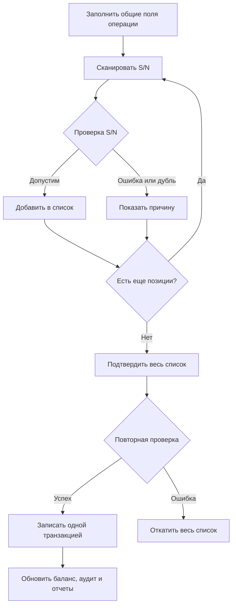
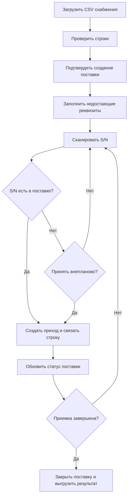

# Основные процессы ODE

## Приход и расход со сканером

При списании неизвестный S/N допускается как проблемная строка. Остальные ошибки подтверждения отменяют всю транзакцию.

## Приемка поставки

