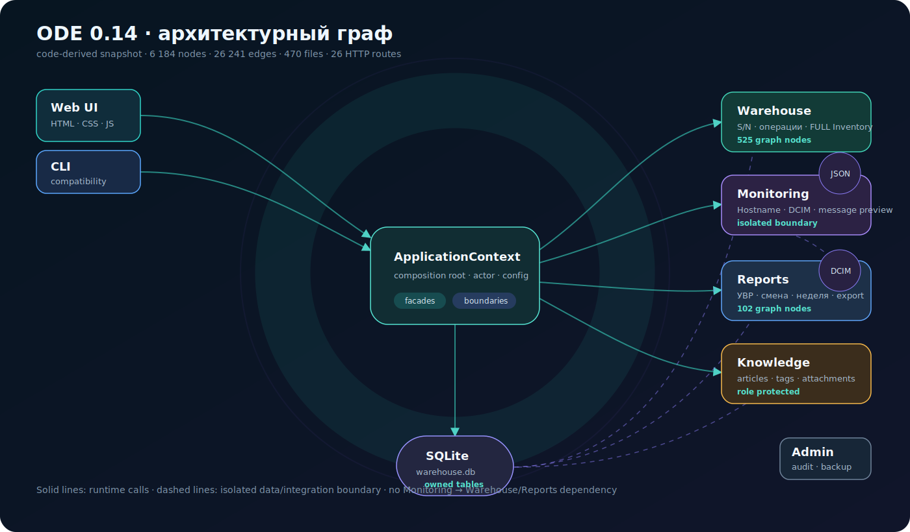
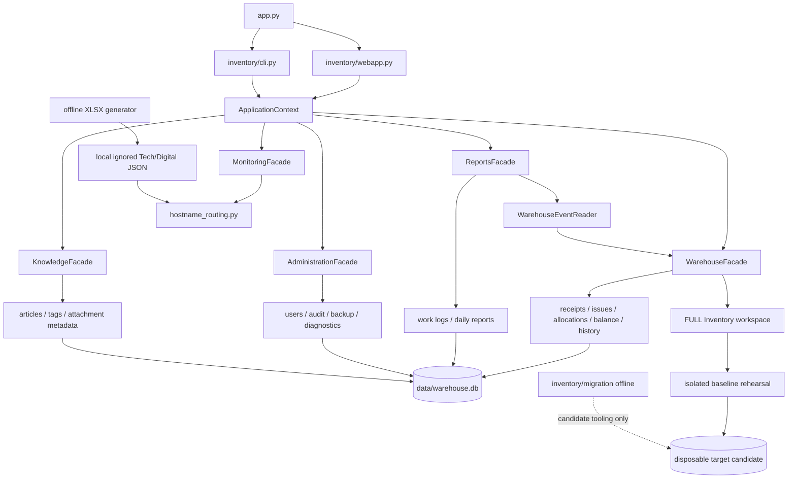

# ODE code relationships

Снимок Codebase Memory от 2026-07-18 содержит 6 184 nodes, 26 241 edges,
470 files и 26 распознанных HTTP routes. В Git публикуется только эта
обобщённая карта; локальный индекс и внутренние данные не публикуются.

GitHub отображает эту Mermaid-диаграмму прямо на странице документа. Она
показывает поддерживаемые архитектурные связи, а не пытается публиковать
внутреннюю базу Codebase Memory.

Отсутствие стрелок Monitoring → Warehouse/Reports является обязательной
границей, а не пропущенной связью.

Интерактивный граф уровня функций/классов из Codebase Memory, похожий на
трёхмерный скриншот, является локальным developer UI и не является встроенной
функцией GitHub. Его cache и `.codebase-memory` artifact запрещено коммитить:
они могут содержать структуру внутреннего кода и быстро устаревают. Текущая
проверенная процедура локальной индексации описана в
[`CODEBASE_MEMORY_MCP.md`](CODEBASE_MEMORY_MCP.md).
