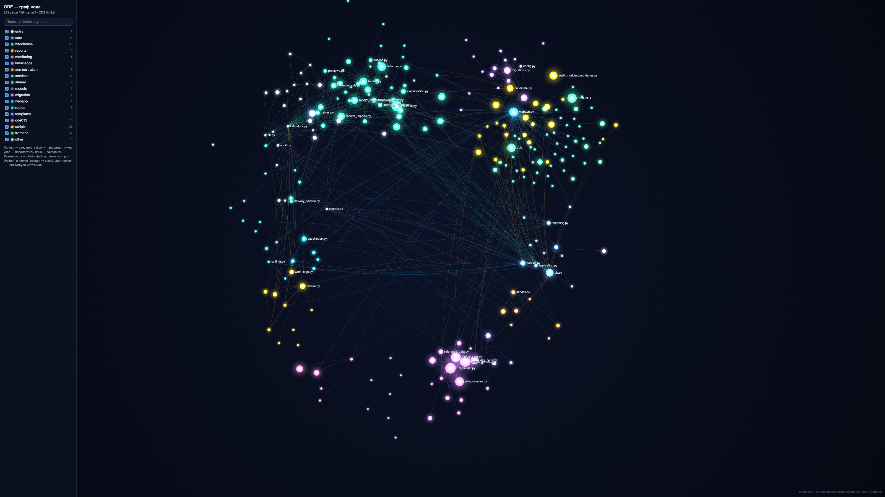
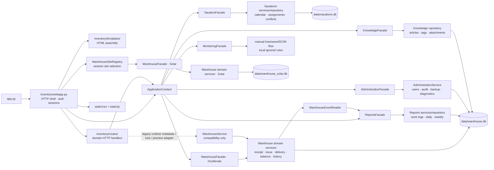
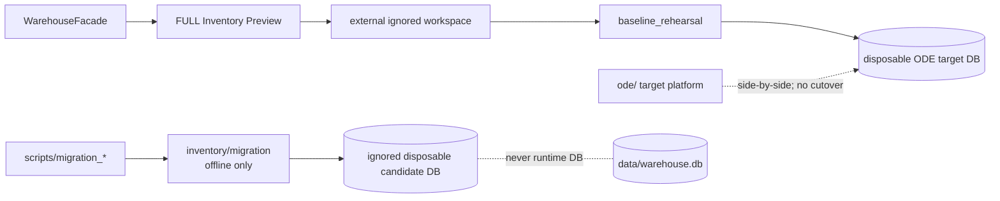

# ODE 0.18.0 — карта кода и зависимостей

## Граф файлов и импортов

- GitHub-friendly PNG:
  [`assets/ode-code-graph-0.18.0.png`](assets/ode-code-graph-0.18.0.png);
- интерактивный self-contained HTML:
  [`assets/code_graph.html`](assets/code_graph.html).

Проверенный full-снимок Codebase Memory от 2026-07-27 содержит 7 067 узлов,
30 991 ребро, 550 файлов и 42 распознанных HTTP-маршрута. В Git публикуются
только эта поддерживаемая карта и детерминированный HTML-граф уровня файлов;
локальный индекс, cache и исходные данные не публикуются.

## Runtime path

```mermaid
flowchart LR
  App["app.py"] --> Web["inventory/webapp.py<br/>HTTP shell · auth · sessions"]
  Web --> Templates["inventory/templates/<br/>HTML assembly"]
  Web --> Routes["inventory/routes/<br/>domain HTTP handlers"]
  Web --> Static["static/css + static/js"]
  Web --> Context["ApplicationContext"]
  Web --> Sites["WarehouseSiteRegistry<br/>session site selection"]

  Routes --> Context
  Routes -. "legacy runtime metadata / lock / preview adapter" .-> Compat["WarehouseService<br/>compatibility only"]
  Context --> W["WarehouseFacade · IXcellerate"]
  Sites --> WS["WarehouseFacade · Solar"]
  Context --> R["ReportsFacade"]
  Context --> M["MonitoringFacade"]
  Context --> K["KnowledgeFacade"]
  Context --> V["VacationFacade"]
  Context --> A["AdministrationFacade"]

  W --> WD["Warehouse domain services<br/>receipt · issue · delivery · balance · history"]
  R --> RD["Reports services/repository<br/>work logs · daily · weekly"]
  A --> AD["AdministrationService<br/>users · audit · backup · diagnostics"]
  K --> KD["Knowledge repository<br/>articles · tags · attachments"]
  V --> VD["Vacations services/repository<br/>calendar · assignments · conflicts"]
  M --> MD["manual hostname/DCIM flow<br/>local ignored rules"]

  WD --> DB[("data/warehouse.db")]
  WS --> WDS["Warehouse domain services · Solar"]
  WDS --> SDB[("data/warehouse_solar.db")]
  Compat --> WD
  RD --> DB
  AD --> DB
  KD --> DB
  VD --> VDB[("data/vacations.db")]
  WD --> Events["WarehouseEventReader"]
  Events --> R
```

Фактический web-path в 0.18.0:

`browser → webapp HTTP shell → session WarehouseSite → inventory/routes →
selected facade → domain service/repository → selected SQLite`.

Shared Administration, Reports, Monitoring, Knowledge и Vacations продолжают
получать primary `ApplicationContext`; Warehouse routes получают выбранный
site runtime.

`inventory/templates` отвечает только за детерминированную HTML-сборку.
Стили и браузерная логика реально загружаются из `static/`; SQL в
`inventory/routes` и `inventory/templates` отсутствует.

`RouteRuntime` пока также передаёт compatibility `WarehouseService`: route
handlers используют его для общего lock, пути/имени БД, старых констант и
одного preview adapter. Это не вторая реализация SQL, но реальная оставшаяся
связь, которую нельзя скрывать на карте. Новые business-вызовы через неё
добавлять запрещено.

## Границы модулей

| Контур | Вход | Реализация | Данные/зависимости |
|---|---|---|---|
| Warehouse | `WarehouseFacade` + `WarehouseSiteRegistry` | `inventory/warehouse/` | независимые `stock_*`, deliveries, balance/history в IXcellerate/Solar; публикует события |
| Reports | `ReportsFacade` | `inventory/reports/` | `work_logs`, `daily_report_*`; Warehouse читает только через `WarehouseEventReader` |
| Administration | `AdministrationFacade` | `AdministrationService` | users, audit, backup/restore, diagnostics |
| Monitoring | `MonitoringFacade` | `inventory/monitoring/` | локальные ignored rules и optional DCIM; не импортирует Warehouse/Reports |
| Knowledge | `KnowledgeFacade` | `inventory/knowledge/` | `knowledge_*` и private attachments |
| Vacations | `VacationFacade` | `inventory/vacations/` | собственные `vacation_*` и audit в `data/vacations.db`; складские БД не используются |

`WarehouseService` и `WarehouseCore` сохранены как compatibility path для CLI,
старых тестов и ещё не перенесённых Python-вызовов. Они делегируют тем же
экземплярам domain-сервисов и не содержат второй реализации складского,
Reports или Administration SQL.

## Offline и target contours

```mermaid
flowchart LR
  Migration["scripts/migration_*"] --> Offline["inventory/migration<br/>offline only"]
  Offline --> Candidate[("ignored disposable candidate DB")]

  Warehouse["WarehouseFacade"] --> Full["FULL Inventory Preview"]
  Full --> Workspace["external ignored workspace"]
  Workspace --> Rehearsal["baseline_rehearsal"]
  Rehearsal --> Target[("disposable ODE target DB")]

  ODE["ode/ target platform"] -. "side-by-side; no cutover" .-> Target
  Candidate -. "never runtime DB" .- Working[("data/warehouse.db")]
```

Migration packages не импортируются runtime Web/API и не публикуют результат
в рабочую БД автоматически. `ode/` остаётся отдельным target-platform треком.

## Как поддерживать карту

- `python3 scripts/generate_code_graph.py` обновляет
  [`assets/code_graph.html`](assets/code_graph.html) из Python AST и
  static-layout; версия читается из `inventory.__version__`.
- PNG `assets/ode-code-graph-0.18.0.png` является GitHub-снимком
  интерактивного графа версии 0.18.0 и обновляется явно при публикации нового
  визуального snapshot.
- `python3 scripts/generate_code_graph.py --check` завершает gate ошибкой, если
  committed HTML устарел.
- `python3 scripts/refresh_project_knowledge.py` обновляет HTML-граф и делает
  внешний full Codebase Memory reindex с `persistence=false`.
- После каждого существенного изменения кода/топологии refresh обязателен;
  найденные связи нужно перепроверять через `rg`, source-read и тесты.

Codebase Memory cache и `.codebase-memory` artifact запрещено коммитить: они
могут содержать подробную структуру кода и быстро устаревают. Безопасная
процедура и исключения описаны в
[`CODEBASE_MEMORY_MCP.md`](CODEBASE_MEMORY_MCP.md).
