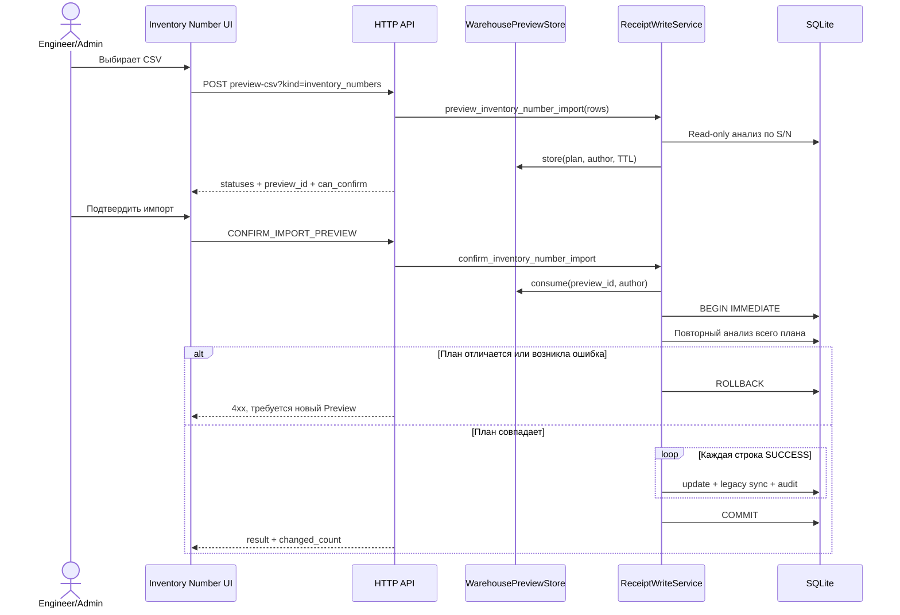

# Bulk Inventory Number Import — Stage 0.13.2

Дата актуализации: 2026-07-14.

Документ является нормативным контрактом массового назначения Inventory Number
в текущем исходном коде ODE. Stage 0.13.2 не является отдельной Windows-
сборкой: runtime-метаданные исходников и target package builder остаются
`0.12.17.1 RC2`, последний фактически собранный ZIP содержит
`ODE 0.12.17 RC1`, а ZIP RC2/Stage 0.13.2 не создавался.

## Назначение и границы

Импорт дополняет Inventory Number у уже существующих складских позиций. Главный
идентификатор позиции — S/N. Inventory Number является вторичным реквизитом,
который может отсутствовать при приходе и быть назначен позднее.

Инварианты:

- поиск выполняется исключительно по `stock_receipts.serial_number`, без
  fallback по Inventory Number, внутреннему ID, модели или другим полям;
- импорт не создаёт `stock_receipts`, legacy `equipment` или другие карточки;
- заполненный другим значением Inventory Number автоматически не
  перезаписывается;
- один Inventory Number не может принадлежать разным позициям;
- preview не изменяет SQLite и не создаёт audit;
- confirm повторно анализирует данные и применяет все строки `SUCCESS` одной
  транзакцией либо откатывает их все;
- каждый реальный update использует существующий audit-backed Timeline.

Не входят в Stage: создание оборудования из CSV, исправление уже назначенных
номеров, удаление Inventory Number, фоновый импорт, отдельный журнал batch-
импортов, новая таблица событий и изменение схемы БД.

## Архитектурный маршрут

```text
static/js/warehouse/inventory.js
        -> HTTP handler inventory/webapp.py
        -> ApplicationContext.warehouse
        -> WarehouseFacade
        -> ReceiptWriteService
        -> ReceiptRepository
        -> SQLite
```

Публичные Python-контракты `WarehouseFacade`:

- `preview_inventory_number_import(rows, filename)`;
- `confirm_inventory_number_import(preview_id)`.

Одиночная форма карточки и массовый CSV используют один repository-контракт
`assign_inventory_number_in_transaction(...)`. Это сохраняет одинаковые
правила заполнения пустого поля, legacy-синхронизации, уникальности и audit и не
создаёт второй реализации бизнес-логики.

## HTTP API

Все маршруты требуют аутентифицированную локальную сессию. Preview и confirm
являются write-capable операциями и разрешены только ролям `engineer` и
`admin`; `viewer` отклоняется сервером, даже если вызовет API напрямую.

| Операция | Контракт | Назначение |
|---|---|---|
| Скачать шаблон | `GET /import/inventory-numbers-template.csv` | UTF-8 BOM, имя `inventory_numbers_template.csv`, заголовок `Serial Number;Inventory Number` |
| Preview | `POST /api/preview-csv?kind=inventory_numbers` | CSV передаётся raw request body; необязательное имя — URL-encoded `X-Filename` |
| Confirm | `POST /api/action` | JSON action `CONFIRM_IMPORT_PREVIEW` с `kind=inventory_numbers` и `preview_id` |
| Direct import | `POST /api/import-csv?kind=inventory_numbers` | намеренно возвращает контролируемую ошибку; обход preview/confirm запрещён |

Пример confirm-запроса:

```json
{
  "action": "CONFIRM_IMPORT_PREVIEW",
  "kind": "inventory_numbers",
  "preview_id": "server-issued-one-shot-token"
}
```

Preview возвращает `ok`, analysis fields, `preview_id` и `can_confirm`.
Confirm возвращает `ok`, повторно вычисленные analysis fields, `imported` и
`changed_count`, но не возвращает `preview_id`/`can_confirm`; оба change-
counters равны количеству реально обновлённых строк. Analysis fields включают
`summary`, `rows`, `errors` и compatibility counters: `total`, `success`,
`unchanged`, `not_found`, `already_assigned`,
`duplicate_inventory_number`, `validation_error`, `valid`, `new`,
`error_count`. Ошибки входа, прав и контракта возвращаются контролируемыми 4xx
без traceback.

## CSV-контракт

Минимальный пример:

```csv
Serial Number;Inventory Number
SN-000001;INV-000001
SN-000002;INV-000002
```

| Поле | Поддерживаемые заголовки | Правила |
|---|---|---|
| `serial_number` | `SN`, `S/N`, `Серийный номер`, `Серийные номера`, `Серийник`, `Serial`, `Serial Number`, `serial_number` | обязательно, строка после trim не пустая, максимум 255 символов |
| `inventory_number` | `Инв.№`, `Инв. №`, `Инвентарный номер`, `Inventory`, `Inventory Number`, `Asset Number`, `inventory_number` | обязательно, строка после trim не пустая, максимум 255 символов |

Parser:

- принимает UTF-8 и UTF-8 BOM; для совместимости делает fallback на CP1251;
- автоматически определяет `;`, `,` или tab по первым 8192 символам;
- при невозможности определить разделитель использует `,`;
- сопоставляет заголовки без учёта регистра, лишних пробелов и различия `е/ё`;
- неизвестные столбцы игнорирует, пустые строки пропускает;
- значения S/N и Inventory Number при анализе trim'ятся и приводятся к верхнему
  регистру;
- принимает не более 40 000 непустых строк и HTTP body не более 50 МБ.

Пустой body, отсутствие строки заголовков или обязательного столбца являются
структурной ошибкой CSV и возвращают HTTP 400 до формирования построчных
статусов. Файл только с корректными заголовками, но без данных, возвращает
summary с `VALIDATION_ERROR=1`, `can_confirm=false` и ошибкой для строки 1.

Номер `line` в результате начинается с 2 и относится к последовательности
непустых распознанных строк. При пустых физических строках он может не совпасть
с номером строки в исходном редакторе.

## Статусы и правила приоритета

| Статус | Условие | Изменение при confirm |
|---|---|---|
| `SUCCESS` | S/N найден, canonical номер пуст, foreign owner отсутствует; тот же номер в linked legacy допустим | назначить номер |
| `UNCHANGED` | тот же номер уже записан в `stock_receipts`, без учёта регистра | нет |
| `NOT_FOUND` | в `stock_receipts` нет такого S/N | нет; карточка не создаётся |
| `ALREADY_ASSIGNED` | в canonical receipt уже другой номер; либо, когда canonical номер пуст, другой номер есть в связанной legacy-карточке | нет |
| `DUPLICATE_INVENTORY_NUMBER` | когда canonical номер пуст, входящий номер принадлежит другой позиции; либо номер планируется нескольким строкам этого CSV | нет |
| `VALIDATION_ERROR` | пустое/слишком длинное поле, неверный тип или повтор S/N внутри CSV | confirm всего preview запрещён |

Если `stock_receipts.inventory_number` пуст, а связанная legacy-карточка уже
содержит тот же входящий номер, строка остаётся `SUCCESS`: основной receipt ещё
нужно синхронизировать. Другой номер в legacy-карточке даёт
`ALREADY_ASSIGNED`.

Порядок классификации:

1. нормализация и проверка обязательных значений;
2. case-insensitive поиск повторов S/N внутри CSV — все вхождения получают
   `VALIDATION_ERROR`;
3. case-insensitive поиск существующей позиции только по S/N;
4. если `stock_receipts.inventory_number` заполнен — немедленно классифицировать
   как `UNCHANGED` или `ALREADY_ASSIGNED` и не выполнять последующие owner-
   checks;
5. только при пустом canonical номере проверить связанную legacy-карточку:
   другой номер немедленно даёт `ALREADY_ASSIGNED` и прекращает дальнейшие
   проверки этой строки;
6. затем проверить владельцев входящего Inventory Number в
   `stock_receipts`/`equipment`;
7. проверить повторное назначение одного свободного номера внутри CSV.

Только `VALIDATION_ERROR` делает `can_confirm=false`. `NOT_FOUND`,
`UNCHANGED`, `ALREADY_ASSIGNED` и `DUPLICATE_INVENTORY_NUMBER` являются
построчными результатами: они не изменяются, а строки `SUCCESS` могут быть
подтверждены.

## Preview lifecycle

Preview читает текущую БД и сохраняет нормализованный план только в
`WarehousePreviewStore` в памяти процесса. БД, справочники и audit не меняются.

Свойства preview:

- криптографически случайный `preview_id`;
- привязка к текущему author, но не к конкретному HTTP session token;
- TTL 3600 секунд;
- одноразовое consume при confirm;
- максимум два активных preview на автора, восемь глобально и 80 000 строк во
  всём warehouse preview store;
- максимум 100 строк возвращаются и для Preview, и для Confirm Result; максимум
  200 validation errors возвращаются для отображения, при этом counters
  вычисляются по всему файлу. Текущий UI не показывает отдельную truncation-
  подсказку, потому что получает уже обрезанный массив.

Preview исчезает при рестарте процесса, истечении TTL или вытеснении лимитами.
После consume, stale-plan или ошибки применения пользователь должен выполнить
новый Preview.

## Confirm и атомарность



`BEGIN IMMEDIATE` устанавливается до повторного анализа, поэтому классификация
и writes видят одно стабильное состояние. Сохранённый и текущий планы
сравниваются по статусу, текущему Inventory Number и receipt ID. Любое
расхождение, database error или failure в середине batch отменяет updates,
legacy-синхронизацию и audit целиком. Частичный commit строк `SUCCESS` не
допускается.

Partial unique index по непустому `stock_receipts.inventory_number` и unique
ограничение legacy `equipment.inventory_number` остаются последней защитой от
гонки/дубликата.

## Данные, audit и Timeline

Основной update — заполнение `stock_receipts.inventory_number`. Если receipt
связан через `legacy_equipment_id` с legacy `equipment` и там номер пуст,
`equipment.inventory_number` синхронизируется той же транзакцией. Новые строки
не вставляются, схема БД и миграции не меняются.

На каждую реально изменённую позицию записывается существующее audit-действие:

- `action`: `EQUIPMENT_INVENTORY_NUMBER_ASSIGNED`;
- `entity_type`: `stock_receipt`;
- `entity_id`: ID найденного receipt;
- `author`: текущий actor из application context;
- `details`: S/N и назначенный Inventory Number.

Equipment Card Timeline уже читает эти audit-записи и показывает их как
`Запись журнала: EQUIPMENT_INVENTORY_NUMBER_ASSIGNED`. Для preview,
`UNCHANGED`, конфликтов и `NOT_FOUND` audit не создаётся. Это не новый тип
`WarehouseEventReader` и не параллельная event subsystem; отдельной batch-
записи об импорте также нет.

## Принятые решения и альтернативы

- Использованы существующие generic preview/action endpoints вместо новых
  специализированных URL: сохраняется единая HTTP/session/error инфраструктура.
- Использован Warehouse-owned in-memory preview store вместо новой таблицы:
  Stage не требует миграции, но preview не переживает restart.
- Выбраны повторный анализ и блокировка до записи вместо слепого применения
  старого preview: stale-план отклоняется целиком.
- Конфликты Inventory Number являются построчными результатами, а повтор S/N —
  blocking validation error: один S/N не может задавать два намерения.
- Переиспользован audit-backed Timeline вместо нового publisher/table: одна
  бизнес-операция создаёт одну понятную историю.
- Массовый flow вызывает transaction-aware repository helper, а не одиночный
  метод с собственной транзакцией: batch сохраняет атомарность.

## Расширение и обязательные проверки

При расширении сохранять S/N-only identity, запрет overwrite и единственную
транзакционную границу. Новые статусы являются изменением публичного API и
требуют синхронного обновления UI, этого документа, CHANGELOG и contract tests.
Перенос preview в persistent/job storage требует отдельного решения по owner,
TTL, idempotency, schema migration и cleanup.

Автоматическое покрытие Stage находится в:

- `tests/test_inventory_number_import_unit.py`;
- `tests/test_inventory_number_import_contract.py`;
- `tests/test_inventory_number_import_api.py`;
- `tests/test_inventory_number_import_frontend_contract.py`;
- `tests/headless_smoke.js`.

Mutation-тесты используют только временные SQLite БД. Рабочая
`data/warehouse.db` не должна применяться для preview/confirm-тестов.
