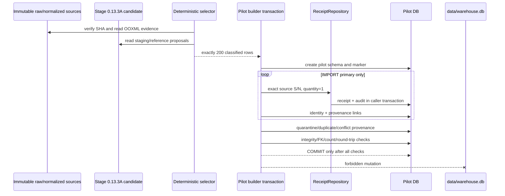
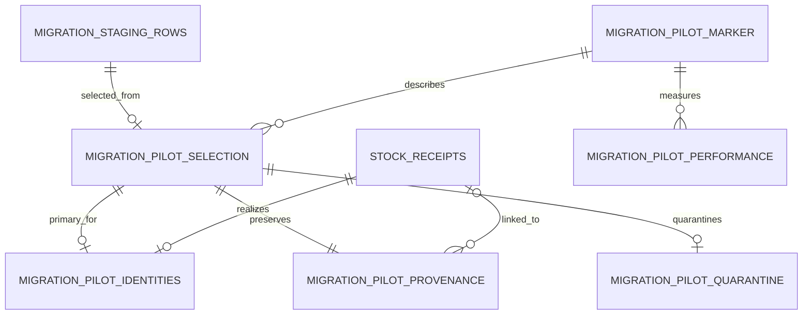

# Migration Pilot Architecture — Stage 0.13.3A.5

Дата: 2026-07-14.

## Status and boundary

- **FACT:** обычный production receipt path нормализует S/N через
  `strip().upper()`, а текущий partial unique index для непустого S/N использует
  `COLLATE NOCASE`. Этот путь не доказывает посимвольную сохранность
  исторического S/N.
- **IMPLEMENTED / PILOT ONLY:** отдельный preservation-aware контракт выбирает
  ровно 200 строк из Stage 0.13.3A staging и создаёт операции только в
  `migration_inputs/workspace/warehouse_pilot_candidate.db`.
- **NOT PRODUCTION:** pilot DB, selection XLSX/Markdown и review UI не являются
  утверждённым историческим импортом, backup или заменой `data/warehouse.db`.
- **FUTURE 0.13.3B:** массовый historical receipt import, production reference
  integration, reconciliation и установка новой рабочей БД.
- **OPEN DECISION:** production-схема для case-distinct S/N, утверждение
  numeric S/N и authority для конфликтующих source facts.

Stage 0.13.3A.5 проверяет путь на малой репрезентативной выборке. Лист
`БАЛАНС`, исторический расход и все невыбранные receipt rows не загружаются.

## Why a separate contract exists

Аудит фактического обычного маршрута показал:

```text
Web/API
  -> ApplicationContext
  -> WarehouseFacade
  -> ReceiptWriteService
  -> receipt validators
  -> ReceiptRepository
  -> SQLite
```

Обычные validators предназначены для интерактивного склада и применяют
`strip().upper()` к S/N. Поиск Equipment Card также использует
case-insensitive lookup. Для миграционного доказательства этого недостаточно:
`Ab-01`, `AB-01`, ` AB-01 ` и `AB 01` нельзя молча считать одной сохранённой
строкой.

Рассматривались варианты:

1. **Использовать обычный receipt service.** Отклонено: source S/N изменился бы
   до записи.
2. **Изменить production schema и весь receipt flow.** Отклонено для пилота:
   слишком широкий риск и требуется отдельный ADR.
3. **Создать вторую складскую систему.** Отклонено: дублировало бы repository,
   audit и Equipment Card.
4. **Выбранный вариант:** migration-specific writer передаёт точный S/N в
   существующий `ReceiptRepository`, работает внутри caller-owned transaction,
   использует текущие `audit_log` и Timeline, но существует только для
   marker-guarded disposable DB.

`inventory/migration` остаётся offline bounded context. Runtime не импортирует
его. Оркестрационный pilot CLI инъецирует Warehouse-owned writer в offline
builder; review runtime читает только allowlisted `migration_pilot_*` поля через
`WarehouseFacade`.

## Preservation-aware row contract

Каждая selected row сохраняет:

- source file, sheet, row and row hash;
- migration batch and staging row IDs;
- exact `source_serial_value` and separate `normalized_match_value`;
- preservation status, XLSX cell type, number format, raw XML token, display
  value and serial-evidence hash;
- source and canonical item names;
- object kind, equipment category/type or component type, vendor, model,
  Part Number, supplier, datacenter proposal and optional shelf;
- source quantity and independently proven source receipt date;
- warnings, conflict codes, selection reasons, quota flags and import decision.

`source_serial_value` is written to `stock_receipts.serial_number` exactly as a
Python `str`. It is never stripped, upper-cased, passed through `int`/`float`,
transliterated or repaired. `normalized_match_value` is a matching/grouping key
only: NFKC, removal of permitted outer invisible/whitespace characters and
casefold. It never replaces the stored source value.

Only `TEXT_EXACT`, non-empty, serialized rows with quantity exactly `1`, a
canonical-name proposal and a source date proven from OOXML may receive
`IMPORT`. Numeric cells remain quarantine material. `SOURCE_CORRUPTED` is
rejected and cannot create a receipt.

The current production unique index cannot represent two case-distinct values
that compare equal under `NOCASE`. The pilot never chooses an alternative
spelling silently: one preserved primary may be linked, while conflicting rows
remain provenance/history. A general production solution requires a separate
ADR before Stage 0.13.3B.

## Deterministic selector

The selector has fixed size `200` and seed/rule identifier:

```text
ODE-0.13.3A.5-PILOT-v1
```

Stable ordering is based on SHA-256 of the seed and immutable source-row hash;
it does not depend on SQLite row-return order or random process state. Source
candidate, raw workbook and normalized serial-review hashes are verified before
selection. Every row records one or more inclusion reasons.

The decision distribution is an executable invariant:

| Decision | Rows | Effect |
|---|---:|---|
| `IMPORT` | 130 | Create one pilot receipt/card for the identity |
| `QUARANTINE` | 10 | Numeric/unproven S/N; no receipt |
| `MANUAL_REVIEW` | 7 | Unresolved reference facts; no receipt |
| `EXACT_DUPLICATE` | 6 | Link literal raw-equivalent provenance; do not create a second receipt |
| `CONFLICT_HISTORY_ONLY` | 35 | Preserve conflicting/variant history; do not create a second receipt |
| `QUANTITY_POSITION_DEFERRED` | 10 | Keep out of serialized import |
| `SOURCE_CORRUPTED_REJECTED` | 2 | Reject damaged receipt S/N |

Only six literal raw-exact duplicate groups have a primary that is simultaneously
date-proven and reference/alias-safe. A seventh candidate remains blocked by a
pending supplier alias and is not promoted to exact. The selected duplicate
history therefore uses 26 identity-conflict groups and 9 date/shelf/order
history-variation groups. It does not weaken the exact definition to satisfy a
quota.

Coverage gates require at least 50 ordinary `TEXT_EXACT` rows, 20 leading-zero
S/N, 20 long text S/N, 20 servers, 20 components, 10 vendors, 20 duplicate
groups, 20 identity-conflict groups, 10 numeric/manual-review rows, every receipt-side
`SOURCE_CORRUPTED` row, a missing-shelf row, a multi-shelf history group, Dell,
Huawei and xFusion, and a Vegman R220 case.

**FACT FROM SOURCE:** the approved sources contain Vegman R220 but no Vegman
R200 row. The selector records `VEGMAN_R200_UNAVAILABLE_FROM_SOURCE`; it does
not synthesize an R200 source row. R200/R220 non-merging is still an executable
canonical-naming unit contract.

## Classification and identity

One normalized identity may have multiple selected source rows, but at most one
pilot receipt. Decisions have these meanings:

- `IMPORT` — preserved primary source row creates the receipt;
- `EXACT_DUPLICATE` — records identical provenance and a skip audit action;
- `CONFLICT_HISTORY_ONLY` — records vendor/model/item/shelf conflict as history;
- `QUARANTINE` and `MANUAL_REVIEW` — remain separate review rows;
- `QUANTITY_POSITION_DEFERRED` — cannot become serialized equipment;
- `SOURCE_CORRUPTED_REJECTED` — hard rejection until independent evidence.

Shelf is optional placement history. It is not part of identity, does not
create another card and does not split serialized balance. Multiple shelves for
one S/N are retained as provenance/warning.

## Canonical naming and references

The pilot consumes Stage 0.13.3A candidate references and alias decisions; it
does not create new production reference values. Equipment names follow
`<Type> <Vendor> <Model>` and component names follow
`<Component type> <Vendor> <Model or Part Number> <Characteristic>` when
structured evidence exists.

Source item text is retained independently. Huawei and xFusion remain distinct,
as do vendor-scoped models and all numeric/suffix-distinct model values. Missing
vendor/model produces a warning/manual decision rather than a new silently
approved reference.

## Pilot DB build and transaction

The builder starts from the validated Stage 0.13.3A candidate and publishes a
different file:

```text
migration_inputs/workspace/warehouse_pilot_candidate.db
```

It preserves the clean current ODE schema and security allowlist, candidate
references/staging, then adds pilot-only tables. The production working DB is
opened only for hash/integrity comparison and is never the output.



Pilot receipts are marked `is_opening_balance=1`. They are visible to balance
and Equipment Card inside the pilot, but `WarehouseEventReader` excludes them
from Reports business receipt events. This prevents a historical reconstruction
from being represented as a current operational receipt.

## Pilot-only schema

The Stage 0.13.3A candidate tables remain present. Six additional tables exist
only in the pilot DB:



- `migration_pilot_marker` — exact marker, stage, read-only/pilot flags, source
  hashes, seed and counts;
- `migration_pilot_selection` — all 200 selected source facts and decisions;
- `migration_pilot_identities` — one preserved primary and one receipt per
  imported match identity;
- `migration_pilot_provenance` — every selected source row and target link;
- `migration_pilot_quarantine` — non-import decisions and resolution state;
- `migration_pilot_performance` — non-secret build/read timing measurements.

These tables are forbidden in `inventory/db.py` and production schema.

### Verified performance snapshot

The 2026-07-14 build on the review workstation measured selection at
`3226.733 ms`, candidate copy/schema at `24.669 ms`, processing all 200 rows at
`26.590 ms` and pilot DB build (after selection) at `58.463 ms`. Database probes
measured list `0.081 ms`, exact S/N search `0.011 ms`, card `0.007 ms` and
Timeline `0.009 ms`. Final headless browser smoke measured initial list
`117 ms`, exact search `611 ms`, card plus Timeline `306 ms` and the full
scenario `2256 ms`. These are environment-specific observations, not latency
SLAs; the stored metrics/report make regressions comparable without running a
51,003-row operational import.

## Timeline and audit

The pilot reuses `audit_log`; it does not introduce a second event system.
Actions are:

- `MIGRATION_RECEIPT_IMPORTED`;
- `MIGRATION_SOURCE_ROW_LINKED`;
- `MIGRATION_CONFLICT_RECORDED`;
- `MIGRATION_EXACT_DUPLICATE_SKIPPED`;
- `MIGRATION_SERIAL_QUARANTINED`.

Audit details are allowlisted and include logical source filename, sheet, row,
source/canonical names and warnings. Absolute local paths are removed. Card
Timeline relabels the business receipt as `Исторический приход (миграция)` and
shows migration provenance separately. Source historical date is preserved as
source evidence; audit timestamp remains the actual migration time.

## Review runtime and API

The review runtime is opt-in and fail-closed:

- environment flag `ODE_MIGRATION_PILOT=1` is required;
- DB basename must be `warehouse_pilot_candidate.db`;
- exact marker `ODE_MIGRATION_PILOT`, stage `0.13.3A.5`, status
  `READY_FOR_REVIEW`, `pilot_only=1` and `review_read_only=1` are required;
- required tables, integrity, foreign keys and absence of WAL/SHM/journal are
  checked before service initialization;
- the DB must not be `data/warehouse.db` or its same file;
- a marked DB without the flag and a flag without a valid marker both fail.

Pilot-only read APIs:

- `GET /api/migration-pilot` — allowlisted paged/filterable selection view;
- `GET /api/position-card?pilot_selection_id=<id>` — an `IMPORT` row or linked
  duplicate/conflict row, resolved to the single primary by exact target
  receipt ID rather than normalized S/N lookup;
- `GET /api/data` includes only safe pilot status metadata.

Only `admin` and `engineer` may read the pilot review. Imported/raw XML tokens,
password hashes and absolute paths are not returned. All operational POST
actions are denied in pilot mode; authentication/logout remain session
infrastructure. The frontend constructs imported values as text DOM nodes and
contains no destructive controls.

After the pre-start guard succeeds, `WarehouseService` is constructed with
`initialize_database=False`. Thus ordinary idempotent schema initialization is
also skipped for the pilot artifact; production/default startup keeps its
existing initialization behavior. Review adapters use immutable/read-only
connections, and headless smoke hashes its temporary pilot DB copy before and
after the complete login/list/card/filter lifecycle.

## Launcher and retention

`start_migration_pilot_macos.command` and
`start_migration_pilot_windows.bat` validate the existing pilot DB and then run
ODE with the explicit flag. They never build, overwrite, copy or install a DB.
The console prints the actual selected path; the browser receives only a logical
relative label and a permanent `МИГРАЦИОННЫЙ ПИЛОТ` banner.

To remove local pilot artifacts after review, stop ODE, confirm no SQLite
sidecars exist, and delete only these ignored outputs—not raw sources or the
working DB:

```text
migration_inputs/workspace/warehouse_pilot_candidate.db
migration_inputs/reports/PILOT_RECEIPT_SELECTION.xlsx
migration_inputs/reports/PILOT_RECEIPT_SELECTION.md
```

Regeneration is the rollback model for this disposable pilot. It is not a
production rollback procedure.

## FUTURE 0.13.3B entry gate

Stage 0.13.3B may start only after manual review records:

1. exact S/N rendering, especially leading zeros and long values;
2. card source/canonical name and structured type fields;
3. Huawei/xFusion and model separation;
4. duplicate/conflict/multi-shelf provenance;
5. numeric/corrupted quarantine decisions;
6. Timeline semantics and security/read-only behavior;
7. accepted reference aliases and unresolved source gaps;
8. a separately approved production schema/reset/import contract.

Pilot approval authorizes planning the next Stage only. It does not authorize
production DB replacement or bulk import.
