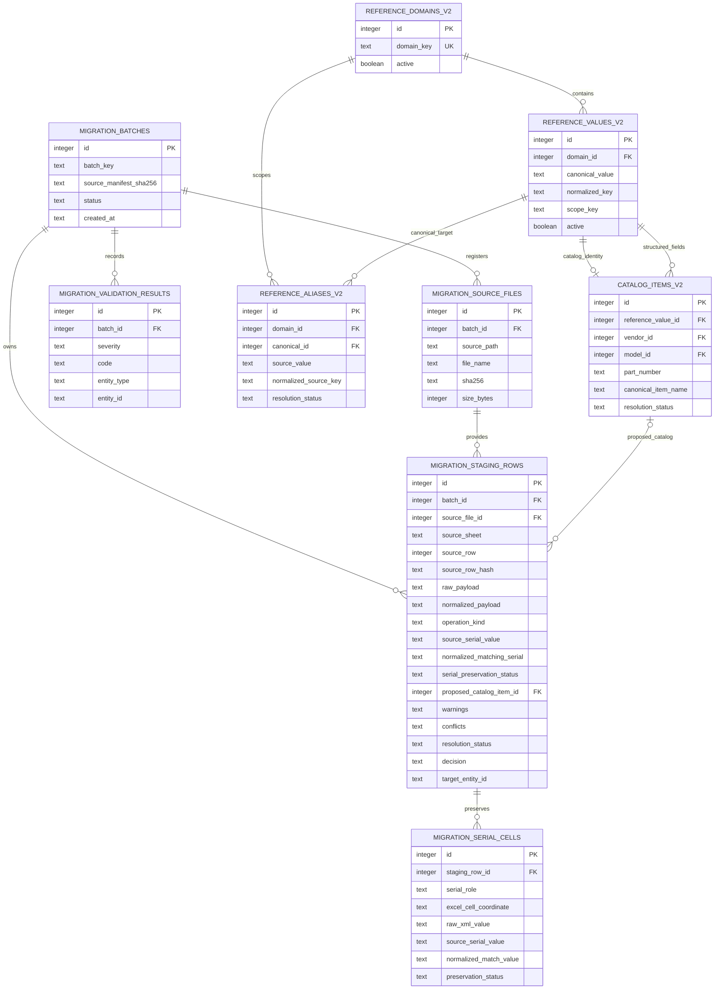

# Migration Staging Architecture — Stage 0.13.3A / 0.13.3A.5

Дата: 2026-07-14.

## Boundary and status

- **FACT:** production ODE has no import-run/source-row provenance tables.
- **IMPLEMENTED:** Stage 0.13.3A provides a separate candidate SQLite schema
  and rule-driven generator/validator under `inventory/migration/`.
- **PROPOSED:** candidate values and decisions are review material.
- **IMPLEMENTED / PILOT ONLY (0.13.3A.5):** exactly 200 selected receipt rows
  may be copied into a separate pilot DB and only 130 preserved primaries may
  create pilot receipts.
- **FUTURE STAGE:** bulk historical receipt/issue import and production
  confirmation/replacement.
- **OPEN DECISION:** final asset/operation production schema and approval model.

Default disposable location:

```text
migration_inputs/workspace/warehouse_migration_candidate.db
```

The offline CLI is `scripts/migration_reference_data.py` with subcommands
`inspect-sources`, `build-candidate`, `validate-candidate` and `report`.
Default generated artifacts are:

```text
migration_inputs/workspace/reference_candidate_package.xlsx
migration_inputs/workspace/serial_preservation.csv
migration_inputs/workspace/candidate_validation.json
```

Existing outputs require explicit `--overwrite` on build. The XLSX is the human
review package; the CSV is an exact UTF-8 machine export and does not claim
desktop-Excel typing safety.

### Generated artifact contracts

`serial_preservation.csv` is UTF-8 with BOM, semicolon-delimited and has this
fixed header order:

```text
source_file;source_sheet;source_row;source_column;excel_cell_coordinate;
excel_cell_type;excel_number_format;raw_xml_value;source_display_value;
source_serial_value;normalized_match_value;preservation_status;warning;
source_hash;source_file_hash;extraction_rule;confidence;
requires_manual_review;serial_role
```

The line breaks above are documentation wrapping only; the actual header is a
single CSV row. `requires_manual_review` is `0`/`1`; `serial_role` is
`SOURCE_SERIAL` or `TARGET_EQUIPMENT_SERIAL`. Identifier-bearing values are
accepted as strings only. This is a machine review export, not a candidate
import/confirm file.

`reference_candidate_package.xlsx` contains text-only (`inlineStr`, number
format `@`) review sheets:

| Sheet | Columns |
|---|---|
| `DOMAINS` | `domain_key`, `display_name`, `description`, `active`, `source`, `created_at`, `updated_at` |
| `VALUES` | `domain`, `canonical_value`, `display_name`, `normalized_key`, `scope_key`, `active`, `approval_status`, `source`, `created_at`, `updated_at` |
| `ALIASES` | `domain`, `source_value`, `normalized_source_key`, `canonical_value`, `source_file`, `source_sheet`, `usage_count`, `confidence`, `resolution_status`, `approved_by`, `approved_at`, `notes` |
| `CATALOG_ITEMS` | `canonical_item_name`, `part_number`, `primary_characteristic`, `normalization_rule`, `confidence`, `requires_manual_review`, `resolution_status`, `source` |
| `UNRESOLVED` | `severity`, `code`, `entity_type`, `entity_id`, `message`, `details`, `created_at` |

The writer rejects non-text identifiers and immediately reparses every sheet,
checks row counts, unique headers and text formatting. The JSON report is a
secret-free validation summary, not an approval token. `report` rebuilds this
allowlisted summary from the candidate and current source checks; it never
reads or merges an existing JSON file. None of these artifacts
has Preview/Confirm or rollback semantics: `build-candidate` is a disposable
review build; the future production import requires a separate contract.

The workspace, candidate DB, sidecars and generated reports are local-only and
must not be committed or packaged. `data/warehouse.db` is never an output.

Stage 0.13.3A.5 creates a separate child artifact; it never overwrites the
candidate above:

```text
migration_inputs/workspace/warehouse_pilot_candidate.db
migration_inputs/reports/PILOT_RECEIPT_SELECTION.xlsx
migration_inputs/reports/PILOT_RECEIPT_SELECTION.md
```

## Purpose

Staging keeps source facts, machine proposals and human decisions separate. A
re-run can explain every candidate reference or future operation without
rewriting the immutable XLSX/TXT.

```mermaid
sequenceDiagram
    participant R as Immutable raw source
    participant X as XLSX/serial extractor
    participant P as Reference/naming proposal
    participant S as Candidate staging DB
    participant V as Validator/report
    participant W as data/warehouse.db

    X->>R: Read bytes; verify SHA
    X->>S: Source cell + preserved S/N metadata
    P->>S: Candidate references, aliases, canonical names
    V->>S: Read schema/content; integrity/FK/security checks
    V->>R: Verify unchanged SHA
    V->>W: Read-only SHA/integrity check
    Note over S,W: No historical operation import and no production write
```

## Logical staging model

Every migration source record carries:

- migration batch ID and immutable source-file identity/hash;
- source sheet/row and deterministic source-row hash;
- operation kind without assuming that the row is importable;
- raw payload and normalized/proposed payload as separate JSON/text values;
- source S/N, normalized matching S/N and preservation status;
- proposed object kind, category/type, vendor, model and catalog item;
- proposed canonical name;
- warnings and conflicts;
- resolution status and explicit decision;
- target entity ID, empty until a future confirmed import.

Raw payload is evidence, not a second source workbook. Normalized payload never
overwrites it.

## Candidate schema

The disposable DB contains three conceptual groups:

1. current clean ODE schema needed to prove compatibility/security;
2. candidate reference domains/values/aliases;
3. migration batch/source/staging records and validation metadata.

**IMPLEMENTED table names:**

- `migration_batches`;
- `migration_source_files`;
- `reference_domains_v2`;
- `reference_values_v2`;
- `reference_aliases_v2`;
- `catalog_items_v2`;
- `migration_staging_rows`;
- `migration_serial_cells`;
- `migration_validation_results`.

The `_v2` suffix prevents accidental confusion with the unchanged production
`reference_values`. Module-boundary audit rejects these names in
`inventory/db.py`.



This diagram describes the candidate bounded context. It must not be copied
into `inventory/db.py` without a separately approved ADR.

## Determinism and provenance

- Source identity is SHA-256 + logical filename; absolute paths are not stored.
- Row hash is calculated from a documented stable serialization of source
  coordinates and raw payload.
- JSON payload serialization is deterministic (stable keys/Unicode handling).
- Stable source/row hashes, normalization keys and proposals are deterministic
  for the same source bytes and rule version. Build timestamps, SQLite byte
  layout and therefore the candidate file SHA may vary between runs; each
  report records the actual generated SHA and validates semantic invariants.
- Machine confidence never sets a human `approved_by` value. A safe
  `AUTO_APPROVED` alias records the explicit rule actor `ODE_SAFE_RULE_V1`;
  pending manual decisions keep approval fields empty.
- Target IDs remain empty in the Stage 0.13.3A source candidate. They are
  populated only in the separate pilot copy for approved `IMPORT` primaries.

## Candidate DB generation

Generation must:

1. resolve and validate input/output paths;
2. reject output equal to, symlinked or hardlinked with `data/warehouse.db`;
3. verify raw manifests and snapshot source/working-DB hashes;
4. build in a temporary file, with foreign keys enabled;
5. initialize a clean current ODE schema without operational rows;
6. preserve required security identity only through a safe read-only mechanism
   when the selected candidate profile requires it;
7. load candidate domains, values, aliases and staging records only;
8. verify every registered source's current SHA-256, size and immutable flag;
9. run `integrity_check`, `foreign_key_check`, schema and content validation;
10. build and round-trip-check the XLSX/CSV/report in the same private temporary
    bundle before publishing any final artifact;
11. publish ancillary review files first and the validated candidate DB last as
    the bundle commit marker;
12. recheck raw and working-DB hashes.

The standalone `report` command also applies the complete path/inode guard
before writing: its output cannot equal or alias the working DB, SQLite
sidecars, raw/normalized inputs, candidate DB or another bundle output.

On POSIX the candidate DB is forced to mode `0600`; validation rejects any
group/other permission bits because the copied security snapshot makes the
candidate as sensitive as a local database backup. Windows does not expose the
same POSIX mode semantics and relies on local file ACLs.

The approved operational extraction bounds are `ПРИХОД` rows 3..51005 and
`РАСХОД` rows 2..20358. They are an explicit source-map contract: worksheet
preformatted/formula tails do not become migration operations merely because
their cells exist.

No receipt, issue, allocation, delivery, work-log or audit history from the
development working DB is authoritative migration data. Candidate counts must
make their absence visible.

## Validation/reporting

The validator reports, without secrets or absolute paths:

- candidate DB SHA-256;
- every registered source's logical name, current SHA-256, size and immutable
  marker (never an absolute path);
- presence of all required candidate tables and queryable required fields;
- integrity/FK result and unexpected SQLite sidecars;
- reference/domain/alias/staging counts;
- alias status counts (unsafe-merge policy itself is covered by focused tests);
- total S/N cells and `SOURCE_CORRUPTED` count; detailed status/warning
  cross-tabs remain available through documented read-only SQL;
- unresolved reference-review counts;
- operational table counts (expected zero at this stage);
- security rows/roles without emitting `password_hash`.

Any mismatch is a non-zero CLI result. A failed build never replaces a valid
existing candidate artifact silently.

## Verified candidate snapshot

**IMPLEMENTED / VERIFIED (current source hashes):**

- 71,360 staging rows: 51,003 `RECEIPT` source rows and 20,357 `ISSUE`
  source rows;
- 91,717 S/N-role cells and a same-size UTF-8 serial export;
- 16 domains, 893 reference values, 916 aliases and 358 catalog-item
  proposals;
- 972 analytical reference rows unresolved by the builder; the exported
  `UNRESOLVED` sheet has 973 rows because it also includes the aggregate
  `SOURCE_CORRUPTED_SERIALS` validation result;
- five registered source artifacts (three manifest-listed raw sources, the
  local SHA manifest and the normalized reference review);
- one copied active administrator for candidate schema/security validation;
- zero rows in every production operational table, `integrity_check=ok`, zero
  legacy production reference rows, target links and unsafe numeric match
  bypasses; `integrity_check=ok`, zero foreign-key errors and no SQLite
  sidecars.

The candidate status is `REVIEW_REQUIRED`. These are staging/proposal counts,
not proof that historical operations or references are approved for import.
The raw files are globally immutable inputs. The normalized reference review
is instead SHA/size-pinned to this batch: changing an approved review requires
an explicit rebuild and produces a new candidate, not a silent in-place update.

## Production isolation

- The candidate connection and production connection are never the same.
- The migration modules are not imported by `inventory/webapp.py`.
- No HTTP endpoint/action is introduced.
- Unknown candidate values do not call current soft-reference collection.
- The candidate is disposable and may be regenerated; it is not a backup.
- The supported default bundle keeps all outputs in one workspace filesystem.
  Custom cross-filesystem output paths can fail during ancillary publication;
  the candidate DB remains the final marker and the partial ancillary files
  must be discarded/rebuilt.
- `scripts/create_clean_test_db.py` is a test-contour tool and is not the
  production reset workflow.

## Stage 0.13.3A.5 pilot extension

The pilot selector consumes the candidate read-only and pins:

- candidate file SHA;
- candidate batch source-manifest SHA;
- exact raw warehouse workbook SHA registered by the candidate;
- normalized `serial_review.xlsx` SHA;
- selector seed/rule version.

It re-reads source receipt date cells from OOXML. Numeric date cells are
accepted only when the raw token is an exact whole day and the number format is
date-like; text dates require exact ISO form. An unproven date blocks `IMPORT`.

Selection output contains all source/preservation/naming fields, decision,
warnings, conflict types, quota flags and deterministic inclusion reasons. The
fixed distribution is 130 `IMPORT`, 10 `QUARANTINE`, 7 `MANUAL_REVIEW`, 6
`EXACT_DUPLICATE`, 35 `CONFLICT_HISTORY_ONLY`, 10
`QUANTITY_POSITION_DEFERRED`, 2 `SOURCE_CORRUPTED_REJECTED`.

The exact label is source-safe, not quota-driven: only six literal
raw-equivalent groups have a date-proven, reference/alias-safe primary. A
seventh has a pending supplier alias. The remaining duplicate coverage is kept
as 26 identity conflicts and 9 date/shelf/order history variations.

The pilot DB retains the nine Stage A candidate tables and adds exactly:

- `migration_pilot_marker`;
- `migration_pilot_selection`;
- `migration_pilot_identities`;
- `migration_pilot_provenance`;
- `migration_pilot_quarantine`;
- `migration_pilot_performance`.

The marker includes exact stage/status/pilot-only/read-only flags, source and
selection hashes, seed, counts and timestamps. Runtime review refuses unknown
`migration_pilot_*` tables or a schema missing its required allowlisted fields.

Each `IMPORT` primary is inserted through the existing Warehouse receipt
repository inside the pilot builder's transaction; `target_receipt_id` then
links selection, identity and provenance. Non-import decisions are stored
without a receipt. A duplicate/conflict group shares one identity/card. Shelf
differences remain provenance and do not create another identity.

Pilot reports and DB are published only after selection count/decision/quota,
exact S/N/type, security marker, operational-row, integrity/FK, no-sidecar and
identifier round-trip checks. Existing outputs require an explicit overwrite
decision; launchers never rebuild artifacts.

See [MIGRATION_PILOT_ARCHITECTURE.md](MIGRATION_PILOT_ARCHITECTURE.md) for the
complete schema/sequence and
[MIGRATION_PILOT_REVIEW_GUIDE.md](MIGRATION_PILOT_REVIEW_GUIDE.md) for manual
review.

## FUTURE STAGE

Stage 0.13.3B may consume only an explicitly approved candidate subset after
the 0.13.3A.5 manual review. It must retain source-row links, preserve S/N, show
conflicts, use a disposable DB first and obtain a separate production
confirmation. Pilot approval is not that confirmation. Historical issues,
balance reconciliation and working-DB replacement remain later decisions.
