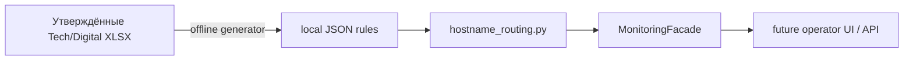

# Monitoring: маршрутизация по hostname

Статус: **IMPLEMENTED backend capability**. Operator UI, сбор из DCIM/Zabbix и
отправка писем в этот slice не входят.

`MonitoringFacade.resolve_hostname()` определяет проект и подготовленные поля
письма по локальным правилам из `data/monitoring`. Excel при запуске ODE не
открывается, сеть и рабочая складская БД не используются.



## Файлы и безопасность публикации

- `Hostname Tech.json` содержит exact/wildcard/ограниченные regex-правила;
- `Hostname Digital.json` содержит точный список Digital hostname и общих
  адресатов. Генератор читает только колонку F `X5T_Support_HostName` листа
  `Технические имена`; колонка E намеренно игнорируется;
- оба JSON содержат внутренние hostname и адресатов, поэтому находятся только
  локально и исключены из Git правилом `/data/monitoring/*.json`;
- публичный репозиторий содержит код, тесты и этот контракт, но не внутреннюю
  инфраструктурную карту компании.

Runtime принимает только JSON version 1, ограничивает размер и число записей,
проверяет hostname, адресатов и regex. Повреждённый или неоднозначный config
обрабатывается fail-closed: случайный проект и готовое письмо не формируются.
Управляющие символы в hostname/теме/адресатах нормализуются или отклоняются.

## Приоритет и результат

Приоритет проектов: `Salt → Digital → X5Tech`. Внутри одного Tech-класса:
`exact → wildcard → regex`, затем большая специфичность. Равнозначные лучшие
правила считаются ошибкой конфигурации. Адресаты дедуплицируются без учёта
регистра и суффикса `@x5.ru`; Tech CC исключает основной `To` и утверждённый
exclusion list.

`RoutingDecision.email_ready=true` означает только то, что обязательные поля
подготовлены без ошибок. ODE не отправляет письмо автоматически.

## Регенерация

Из корня проекта:

```bash
python3 scripts/generate_hostname_rules.py \
  --tech-source /approved/tech.xlsx \
  --digital-source /approved/digital.xlsx \
  --digital-default-to Local.Digital.Owner \
  --tech-cc-exclusion Local.Excluded.Recipient
```

Флаги `--digital-default-to` (обязателен хотя бы один) и
`--tech-cc-exclusion` можно повторять; реальные значения остаются только в
локальном JSON/командной строке и не зашиваются в публичный код. Пути обоих
source-файлов обязательны, output по умолчанию записывается в
`data/monitoring`. Генератор работает на Python standard library
через безопасный read-only OOXML-reader ODE, проверяет ZIP path/размеры и пишет
каждый JSON атомарной заменой. `openpyxl` не требуется.

После регенерации необходимо выполнить:

```bash
python3 -W error::ResourceWarning -m unittest tests.test_monitoring_hostname_routing -v
python3 scripts/audit_module_boundaries.py
```

## Границы

Monitoring не импортирует Warehouse, Reports, `WarehouseService` или
`WarehouseCore`, не читает и не меняет `data/warehouse.db`. Следующие этапы
должны отдельно добавить authenticated API, operator UI, сбор внешних данных и
явное подтверждение отправки; hostname routing нельзя превращать в скрытую
автоматическую рассылку.
