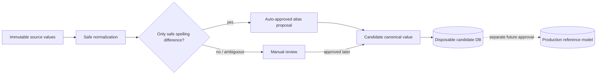
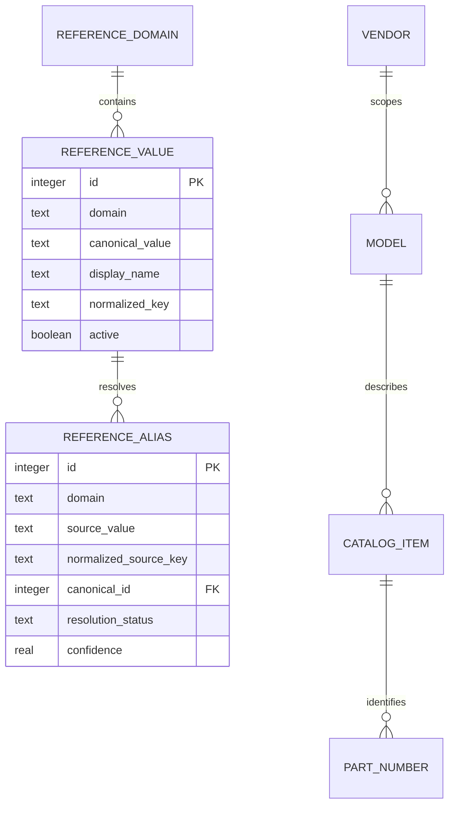

# Reference Data Architecture — Stage 0.13.3A / 0.13.3A.5

## Runtime status after Warehouse stabilization

Canonical Reference Data теперь является production runtime-источником для
Warehouse, а не только offline migration foundation. Единственный путь —
существующий Reference API/facade и `ReferenceDataService`; второй API и
полная загрузка operational rows в browser не создаются.

Обычные формы получают только active/APPROVED. CANDIDATE, PENDING aliases и
inactive доступны администратору. «Другое» создаёт CANDIDATE и не активируется
автоматически. Safe case/space aliases могут быть AUTO_APPROVED; legal/semantic
supplier aliases остаются PENDING. Vendor `Huawei` и `xFusion` различны, а
model identity использует `(vendor scope_key, normalized model)`.

Production baseline: 46 active vendors, 336 active vendor-scoped models,
31 active suppliers, 24 active shelf values и один active datacenter
`Ixcellerate`. Исторические aliases/raw values остаются в operational/provenance,
но не попадают в dropdown.

Редактор показывает canonical/status/aliases/parent/usage/timestamps/author/
source/warnings. Физического delete используемого значения нет: deactivate или
merge после impact preview. Все writes role-checked, transactional и audited.

Дата: 2026-07-14. Source stage: 0.13.3A.5. Runtime metadata:
`0.12.17.1 RC2`.

## Status legend

- **FACT** — факт текущего production-кода или immutable source.
- **IMPLEMENTED** — реализовано в offline/candidate-контуре Stage
  0.13.3A.
- **PROPOSED** — кандидат для review, но не production master data.
- **FUTURE STAGE** — потребует отдельного ADR/реализации/приёмки.
- **OPEN DECISION** — автоматического решения нет.

## Boundary

**FACT (obsolete, kept for history):** до promotion полного historical
candidate (см. `CLAUDE.md` → «Текущий локальный контур») production ODE
использовал только плоскую `reference_values(kind, name, is_active,
created_at)`, а reference/alias-модель из `inventory/migration/` жила
исключительно в disposable candidate DB, не подключённой к
`ApplicationContext`. Этот раздел описывал состояние до стабилизации склада и
больше не соответствует коду.

**FACT (current):** после promotion `reference_domains_v2` /
`reference_values_v2` / `reference_aliases_v2` реально присутствуют и
заполнены в production `data/warehouse.db` (20 доменов, 931 значение по
состоянию на 2026-07-14). `ReferenceDataService.has_v2()`
(`inventory/warehouse/references.py`) обнаруживает эти таблицы и
`form_references()`/`form_reference_sets()` читают из них для каждого домена
из `FORM_DOMAIN_MAP` (vendor, model, supplier, shelf, datacenter,
warehouse_location и др.). Плоская `reference_values` остаётся только
fallback-путём для доменов без v2-аналога (`task_type`, `work_log_status`) и
для инсталляций без v2-таблиц. `inventory/migration/` (offline pipeline)
по-прежнему не импортируется из runtime — production v2-таблицы были
заполнены promotion-процедурой, а не прямым импортом migration-модуля в
Warehouse.

## Controlled domains

**IMPLEMENTED** domain registry:

| Domain | Purpose | Initial controlled values or source |
|---|---|---|
| `object_kind` | Зерно учёта | `equipment`, `component`, `cable`, `consumable`, `unknown` |
| `equipment_category` | Крупная категория | server equipment, network equipment, storage, SAN, power/infrastructure, other |
| `equipment_role` | Роль оборудования | review-controlled source candidates; not inferred from arbitrary names |
| `equipment_type` | Физический тип | server, switch, storage system, SAN switch, load balancer, PDU, UPS, other |
| `component_type` | Тип компонента | CPU, memory, SSD, HDD, NIC, HBA, RAID controller, PSU, fan, transceiver, motherboard, other |
| `cable_type` | Физический тип кабеля | `UTP`, `OM4`, `MTP`, `AOC`, `DAC`, `other`; other source values remain candidates |
| `cable_category` | Категория кабеля | `copper`, `fiber`, `active`, `unknown` |
| `vendor` | Бренд/производитель | candidate package from source profiling |
| `model` | Модель в vendor scope | candidate package; same text under different vendors is not one proven model |
| `catalog_item` | Канонический продукт | structured vendor/model/Part Number/type proposal |
| `supplier` | Поставщик/юрлицо | legal-name variants require manual authority |
| `datacenter` | ЦОД | source candidates; parent identity remains reviewable |
| `warehouse_location` | Место хранения | raw composite retained; parsing is proposal-only |
| `unit_of_measure` | Единица измерения | `piece`, `metre`; must not be confused with rack unit |
| `operation_source` | Происхождение операции | `legacy_xlsx_receipt`, `legacy_xlsx_issue`, `manual`, `DCIM`, `migration` |
| `issue_reason` | Причина расхода | controlled candidate; source semantics require review |

Part Number — structured catalog attribute, а не синоним model и не
свободное item name. S/N, Inventory Number, hostname, PLU,
request/order/case, comments, DCIM ID и URL не являются
reference domains.

## Canonical reference contract

**IMPLEMENTED** logical fields for every candidate reference:

| Field | Invariant |
|---|---|
| `domain` | One registered domain; cross-domain IDs are invalid |
| `canonical_value` | Stable canonical content, not a raw alias |
| `display_name` | Human-readable presentation; may evolve independently |
| `normalized_key` | Deterministic safe lookup key inside the domain |
| `scope_key` | Empty for ordinary domains; normalized vendor key for a model |
| `active` | Explicit lifecycle flag; inactive is not deleted |
| `source` | Seed/review/source provenance |
| `created_at`, `updated_at` | UTC/explicit timestamp representation used by candidate schema |

`normalized_key` применяет Unicode NFKC, внешние пробелы,
схлопывание повторных whitespace separators и casefold. Это правило
относится к reference values, но **не** к S/N: serial match key не
удаляет и не схлопывает внутренние пробелы.

## Alias contract

**IMPLEMENTED** logical alias fields:

| Field | Meaning |
|---|---|
| `domain` | Domain of both alias and canonical target |
| `source_value` | Exact source spelling retained for review |
| `normalized_source_key` | Safe lookup key; never replaces source text |
| `canonical_id` | Candidate canonical reference ID |
| `source_file`, `source_sheet` | Provenance without absolute local path |
| `usage_count` | Number of source uses represented by this row |
| `confidence` | Machine proposal confidence, not approval |
| `resolution_status` | `AUTO_APPROVED`, pending review, approved or rejected lifecycle |
| `approved_by`, `approved_at` | Rule actor/time for safe auto-approval, human actor/time only after a manual decision |
| `notes` | Non-secret justification or conflict note |

### Safe automatic approval

An alias may be auto-approved only when the proposed canonical and source are
equal after transformations from this closed set:

1. Unicode NFKC;
2. outer whitespace removal;
3. repeated whitespace collapse;
4. case-only comparison.

The rule and the actual source/canonical values remain visible. Confidence is
not a substitute for proof. Unknown values remain proposed/manual-review rows;
they are never inserted into production references by this layer.

Candidate rows with `resolution_status=AUTO_APPROVED` record the non-human
actor `ODE_SAFE_RULE_V1` and its execution timestamp. Pending semantic or
ownership decisions keep both approval fields empty; the marker must never be
presented as a human approval.

Pure Python proposals use `AUTO_APPROVED`, `PENDING_REVIEW`, `CANDIDATE`,
`APPROVED` and `REJECTED`. Candidate SQLite constraints use the storage spelling
`AUTO_APPROVED`, `PENDING`, `APPROVED`, `REJECTED` for aliases and
`APPROVED`, `CANDIDATE`, `REJECTED` for canonical values; the candidate builder
performs the explicit mapping rather than treating status text as free input.

## Candidate package from analytical review

**FACT:** `migration_inputs/normalized/reference_candidates.xlsx` contains
1,153 proposals: model 393, catalog item 376, Part Number 201, vendor 76,
supplier 41, warehouse shelf 32, component type 11, equipment role 7,
equipment category 5, object kind 4, cable type 3, Capex/Opex 2 and issue reason
2. The file is an analytical preview, not an approved import file.

149 rows are marked as not requiring manual review by the analytical safe-text
rule; 1,004 require review. A package flag is revalidated by the executable
alias policy rather than trusted as approval. In particular, the 393 model rows
do not become safe model aliases without vendor scope.

The source-package domains `part_number`, `warehouse_shelf` and `capex_opex`
are not blindly converted into independent references: Part Number stays a
catalog attribute, warehouse shelf may map to `warehouse_location` only through
an explicit provenance rule, and Capex/Opex remains outside the Stage 0.13.3A
registry. 128 Part Number proposals already classified as `SOURCE_CORRUPTED`
must never become canonical values.

**VERIFIED IMPLEMENTED SNAPSHOT:** the generated candidate contains 893
reference values and 916 aliases: 517 `AUTO_APPROVED` by
`ODE_SAFE_RULE_V1` and 399 `PENDING`. It contains 358 structured catalog-item
proposals, all still manual-review candidates. These counts describe the
current immutable source hashes and must be regenerated if a source or rule
version changes.

### Mandatory manual review

Never auto-merge:

- Huawei with xFusion;
- HP with HPE;
- Hunix with Hynix;
- different legal supplier names;
- distinct models, including Vegman R200 and Vegman R220;
- semantically similar product descriptions without catalog evidence;
- values that require transliteration, punctuation removal or guessed typo repair.

`Vegman R200`/`Vegman R220` above is a model-separation rule and test fixture,
not a claim that both occur in the current source. **FACT:** approved migration
sources contain R220 but no R200 row; the pilot must report that coverage gap
and must not synthesize an R200 candidate/source fact.

## Catalog relationships

**PROPOSED**, candidate-only relationship:

The diagram is a candidate semantic model, not the ER schema of
`data/warehouse.db`. Exact candidate tables are documented in
[MIGRATION_STAGING_ARCHITECTURE.md](MIGRATION_STAGING_ARCHITECTURE.md).

## Receipt UX contract

**FUTURE STAGE:** the engineer will select object kind, category, equipment or
component type, vendor, model, optional Part Number and supplier through
dependent references. The UI will show the generated canonical name before
save, keep the raw source text, allow `Other / unknown`, and route unknowns to
review instead of silently adding a reference. Shelf remains optional and is
not part of serialized identity.

No part of this UX is claimed as implemented in Stage 0.13.3A.

## Stage 0.13.3A.5 pilot consumption

**IMPLEMENTED / PILOT ONLY:** the 200-row receipt pilot consumes candidate
reference values, aliases and canonical-name proposals from the disposable
Stage 0.13.3A DB. It does not promote them into production
`reference_values`, approve pending aliases or call current soft-reference
collection.

Pilot rows retain both structured proposal and source text. A missing or
unresolved vendor/model receives `MANUAL_REVIEW` or a warning; it is not
silently inserted as a new reference. `IMPORT` uses an already generated
candidate canonical name and records its provenance. Huawei/xFusion and all
vendor-scoped models remain separate. Shelf remains source placement and is not
a reference identity or card identity.

The read-only pilot UI displays these proposals for review but has no create,
edit, merge or approve controls. Any human approval remains outside this Stage
and must be recorded against exact selection/source hashes.

**NOT PRODUCTION:** pilot cards do not prove the candidate reference package is
approved master data. **FUTURE 0.13.3B:** only explicitly approved references
may enter a separately designed bulk import/reset flow.

## Invariants and extension rules

- Domain + scope + normalized key uniqueness is candidate-local and
  case-insensitive by deterministic key, not by destructive source rewrite.
  Model `scope_key` is its normalized vendor; equal model text under different
  vendors therefore remains distinct.
- An alias resolves within exactly one domain.
- A model never loses its vendor scope during automatic matching.
- Canonical display name is derived presentation, not an identifier.
- S/N remains the serialized-card identity; canonical item and model IDs do not
  replace it.
- New domains require an explicit contract, ownership, seed policy, alias rule,
  tests and documentation.
- Production integration requires a separate ADR/schema migration and must
  disable silent unknown creation intentionally, not as an accidental side
  effect of candidate tooling.

## OPEN DECISIONS

- Authoritative legal supplier/vendor directory and approval authority.
- Whether model identity is strictly `(vendor, model)` or additionally scoped
  by product family.
- Final parent/child representation for datacenter and warehouse locations.
- Production migration strategy from flat `reference_values` without breaking
  current API/UI.
- Approval workflow, roles, retention and audit event vocabulary for reference
  decisions.
