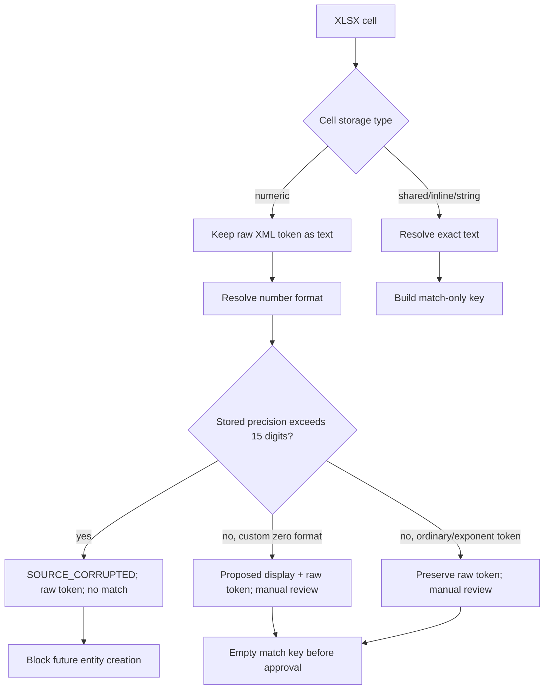

# Serial Number Preservation — Stage 0.13.3A / 0.13.3A.5

Дата: 2026-07-14.

## Non-negotiable invariant

S/N is the main serialized business identifier. The migration layer must never
turn it into `int` or `float`, round it, drop leading zeros, replace characters,
guess lost digits, or substitute a normalized match key for the source value.

`001234567` and `1234567` are different identifiers.

## Status

- **FACT:** the source workbook contains text and numeric S/N cells, exponent
  presentation and identifiers for which Excel precision is already lost.
- **IMPLEMENTED:** XLSX raw-cell extraction and a preservation decision layer
  retain source metadata and separate source value from matching value.
- **PROPOSED:** ambiguous/corrupted values remain staging decisions.
- **IMPLEMENTED / PILOT ONLY (0.13.3A.5):** approved `TEXT_EXACT` source S/N
  can create/link a historical receipt only inside the marker-guarded
  disposable pilot DB.
- **FUTURE 0.13.3B:** approved preservation decisions may be consumed by a
  separately reviewed bulk historical import; pilot decisions do not authorize
  production writes.

## Extracted record

For every source S/N cell the extractor preserves:

| Field | Meaning |
|---|---|
| `source_file` | Relative/logical source filename, never an absolute local path |
| `source_sheet` | Exact worksheet name |
| `source_row`, `source_column` | One-based source position |
| `excel_cell_coordinate` | A1 coordinate |
| `excel_cell_type` | XLSX type token/resolved cell kind |
| `excel_number_format` | Resolved number-format code |
| `raw_xml_value` | Exact `<v>`/inline/shared-string source token when available |
| `source_display_value` | Deterministic display reconstruction when provable |
| `source_serial_value` | Best source-preserving identifier value |
| `normalized_match_value` | Match-only key; never stored as the source S/N |
| `preservation_status` | Explicit preservation/corruption decision |
| `warning` | Human-readable non-secret reason |
| `source_file_hash` | SHA-256 of the complete immutable source file |
| `source_hash` | Cell-evidence SHA-256 over `source_file_hash`, sheet, coordinate and raw token, each separated by a NUL byte |
| `rule`, `confidence`, `requires_manual_review` | Decision provenance |

## XLSX extraction

`xlsx_cells.py` reads XLSX as ZIP/XML and does not save the source workbook.
It resolves workbook relationships, worksheet cell tokens, shared strings,
inline strings, styles and number formats. Raw numeric `<v>` content is kept as
text. Python binary floating point is never used to reconstruct an identifier.

## Text cells

For text/shared-string/inline-string cells:

- the resolved text, leading zeros, case, Cyrillic/Latin characters, internal
  spaces, hyphens and ordering are retained in `source_serial_value`;
- Unicode is not transliterated or confusable-corrected;
- blank or whitespace-only source is not a serial;
- an unusual format alone is not evidence that a value is invalid.

## Numeric cells

1. Preserve the raw XML numeric token verbatim as text.
2. Resolve the Excel number format without opening/saving the workbook.
3. Use `Decimal` only for analysis/display rules; never use `float`.
4. Determine whether the stored token contains enough significant digits.
5. If a custom zero format unambiguously defines leading zeros, retain both the
   raw token and reconstructed display value, record the exact rule/confidence,
   and mark it for manual review according to policy.
6. If Excel already rounded a value beyond its precision, mark
   `SOURCE_CORRUPTED`; do not manufacture the missing digits.

Exponent notation is never expanded into an automatically matchable S/N. The
raw exponent token remains `source_serial_value`; a decimal expansion may be
shown only as a review aid. Tokens whose stored precision is still within
Excel's limit are `NUMERIC_FORMAT_UNPROVEN`; tokens beyond that limit are
`SOURCE_CORRUPTED`. Both have an empty match key and require a decision.

## Match-only normalization

The closed allowed set is:

- Unicode NFKC;
- removal of outer whitespace;
- removal/collapse of explicitly recognized invisible characters only at the
  outside edges;
- case-insensitive comparison (`casefold`).

It is forbidden to remove or collapse internal whitespace, delete hyphens,
drop leading zeros, transliterate, replace Cyrillic/Latin lookalikes or reorder
characters. Thus `AB 12` and `AB12` retain different match keys.

## Preservation decisions

The exact `PreservationStatus` values are:

| Status | Meaning / matching policy |
|---|---|
| `EMPTY` | No matchable source characters; no entity identity |
| `TEXT_EXACT` | Source text retained code-point-for-code-point; warnings may still require review |
| `NUMERIC_FORMAT_RECOVERED` | Custom all-zero number format proves a proposed display padding; raw token and rule retained, no match key before approval |
| `NUMERIC_FORMAT_UNPROVEN` | Numeric token retained, but display/leading-zero semantics are not proven; no match key |
| `FORMULA_UNSAFE` | Formula cell is not authoritative for S/N; no match key |
| `SOURCE_CORRUPTED` | Precision/type is not recoverable safely; no match key or future entity creation |
| `UNSUPPORTED_CELL_TYPE` | Unsupported OOXML type; no match key and manual review |

`TEXT_EXACT` may still have `requires_manual_review=true` for internal spaces,
mixed Latin/Cyrillic or scientific-looking text. Status and review requirement
are separate fields.

## Output contract

Every generated CSV field containing S/N, Inventory Number, Part Number,
request/order/PLU is accepted only as Python `str` and emitted as exact UTF-8
machine text. CSV has no cell-type metadata and cannot prevent desktop Excel
from applying import heuristics; identifier review intended for Excel must use
XLSX. Every generated XLSX cell is OOXML `inlineStr` with number format `@`.

Round-trip validation must reopen/reparse the output and compare code points,
not formatted numeric values. Required fixtures:

- `00012345`;
- `001A020`;
- `0000000000000001`;
- `2102313CKX10LC000033`;
- a Cyrillic S/N;
- mixed Cyrillic/Latin S/N;
- numeric cell with custom zero format;
- scientific notation;
- more than 15 numeric digits;
- a value with internal spaces.

## Source immutability

- Hash every raw source before and after extraction.
- Open XLSX as read-only bytes/ZIP; never call a workbook save method.
- Outputs must be outside `migration_inputs/raw/`.
- A hash mismatch is a hard failure.
- The working DB hash and SQLite integrity are independently checked before and
  after candidate generation.

## Verified Stage 0.13.3A source result

**FACT:** an exhausted exact extraction over the approved operational ranges
`ПРИХОД!L3:L51005`, `РАСХОД!D2:D20358` and
`РАСХОД!J2:J20358` inspected 91,717 explicit S/N-role cells:

| Status | Cells |
|---|---:|
| `TEXT_EXACT` | 72,889 |
| `NUMERIC_FORMAT_RECOVERED` | 0 |
| `NUMERIC_FORMAT_UNPROVEN` | 11,190 |
| `SOURCE_CORRUPTED` | 4 |
| `EMPTY` | 7,634 |

All 11,194 non-empty numeric S/N cells require manual review and none has a
non-empty `normalized_match_value`. A further 344 `TEXT_EXACT` cells require
review for internal whitespace, mixed Latin/Cyrillic or scientific-looking
text, so the total manual-review count is 11,538. The four
`SOURCE_CORRUPTED` cells are
`ПРИХОД!L19513`, `ПРИХОД!L19580`, `РАСХОД!J4826` and
`РАСХОД!J4866`; their `normalized_match_value` is empty. They represent
two damaged numeric values repeated between receipt and issue.

The physical worksheet contains a preformatted blank receipt tail and a
200-row formula tail outside the issue Excel table. Those cells are not
operation rows; the approved source-range map records the bounds explicitly
instead of inferring them from worksheet `max_row`.

## Stage 0.13.3A.5 pilot enforcement

The pilot selector reads receipt-side evidence from the Stage 0.13.3A candidate
and independently re-reads source date cells from raw OOXML. It pins the source
candidate, raw workbook and normalized serial-review hashes before choosing any
row.

Only rows satisfying all of these conditions may receive `IMPORT`:

- `serial_preservation_status=TEXT_EXACT`;
- non-empty exact `source_serial_value` and independent match key;
- serialized quantity exactly `1`;
- no blocking identity decision;
- canonical-name proposal available;
- historical receipt date proven from an OOXML date token/format.

`MigrationPilotReceiptWriter` deliberately bypasses ordinary receipt
validation because that validator applies `strip().upper()`. It passes the
original Python `str` directly to the existing transaction-aware repository and
then re-reads SQLite to assert `typeof(serial_number)='text'` and exact string
equality. It never creates a legacy `equipment` row.

Leading-zero and long text S/N therefore remain exact in all three places:
selection report, `migration_pilot_selection.source_serial_value` and
`stock_receipts.serial_number`. Required pilot coverage includes at least 20
leading-zero and 20 long text rows. Generated XLSX identifier cells use text
format `@` and are reparsed after write.

Numeric statuses do not become pilot identities:

- 10 `NUMERIC_FORMAT_UNPROVEN` receipt rows are `QUARANTINE`;
- all two receipt-side `SOURCE_CORRUPTED` rows are
  `SOURCE_CORRUPTED_REJECTED`;
- both groups have no receipt/card and remain available only as evidence.

Exact duplicates and identity conflicts group by match-only key but retain the
chosen primary's source spelling. No alternate spelling is silently written.
Because the current production S/N index uses `COLLATE NOCASE`, two
case-distinct S/N values cannot safely coexist in that schema. The pilot records
this incompatibility and defers a production fix to a separate ADR.

The Equipment Card pilot endpoint resolves the selected row by exact linked
receipt ID, then verifies that the returned stored S/N equals
`source_serial_value`. It does not use the ordinary normalized S/N lookup for
the proof.

See [MIGRATION_PILOT_ARCHITECTURE.md](MIGRATION_PILOT_ARCHITECTURE.md) for the
full selection/import/runtime boundary.

## Full candidate enforcement

The full historical candidate keeps pilot `TEXT_EXACT` rules and additionally
imports `NUMERIC_FORMAT_UNPROVEN` as a separate provisional identity domain.
Its display value is expanded from the literal raw OOXML token using
`Decimal`; `float` is never used. The raw exponent token remains provenance,
the identity is non-authoritative/manual-review, and backend Inventory Number
assignment is forbidden. It never auto-matches a `TEXT_EXACT` identity.

`SOURCE_CORRUPTED` creates no card, receipt or issue and stays in quarantine.
Every source row, including corrupted and quantity/deferred rows, remains in
the full reconciliation report. See
[FULL_WAREHOUSE_MIGRATION.md](FULL_WAREHOUSE_MIGRATION.md) for counts, opening
states and rebuild/review procedures.

## Known limitations

- Excel precision loss cannot be reversed by code.
- A number format can prove display padding but cannot prove the business
  meaning of an identifier.
- Visual screenshots or cached formula values are not authoritative raw tokens.
- Matching by normalized key can expose a conflict; it never authorizes source
  rewrite or silent merge.
- The production `COLLATE NOCASE` index is not a case-sensitive identity model;
  Stage 0.13.3A.5 does not migrate it.

## OPEN DECISIONS

- Whether any reviewed numeric status may proceed in Stage 0.13.3B after an
  explicit row/batch decision; the extractor itself never auto-approves one.
- Who supplies authoritative replacements for `SOURCE_CORRUPTED` values.
- Whether reconstructed leading-zero displays require per-row approval or a
  batch-approved source-format rule.
