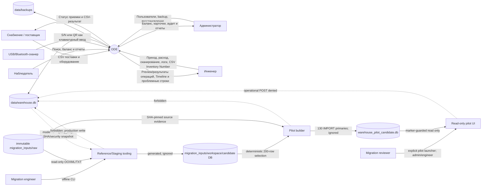

# Контекстная диаграмма ODE

Диаграмма отражает source Stage 0.13.3A.5; runtime metadata остаётся
`0.12.17.1 RC2`. Внешние интеграции с DCIM, Kaiten и мониторингом не
реализованы.

ODE слушает `127.0.0.1:8765` по умолчанию. Состояние хранится в локальной SQLite-базе; сервер приложения не обращается к интернету.

**IMPLEMENTED:** `inventory/migration` и
`scripts/migration_reference_data.py` изолированы от Web/API runtime. Candidate
содержит 16 reference domains и девять staging/reference tables только для
review; historical receipt/issue не импортируется.

**FUTURE STAGE / OPEN DECISION:** перенос утверждённых candidate data и замена
рабочей БД отсутствуют на диаграмме как действующие потоки, потому что требуют
отдельного stage, backup/reset gate и явного подтверждения.

**IMPLEMENTED / PILOT ONLY (0.13.3A.5):** reviewer sees a fixed 200-row sample,
source/canonical names, exact S/N, provenance and audit-backed Timeline. The
pilot DB is neither the Stage A candidate nor the production DB; launch requires
an exact marker and environment opt-in. The source contains R220 but no R200,
and the pilot does not synthesize missing source data.
