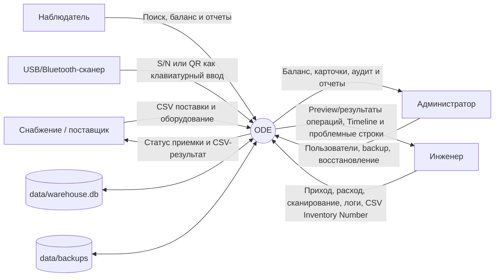

# Контекстная диаграмма ODE

Диаграмма отражает текущий локальный браузерный контур. Внешние интеграции с DCIM, Kaiten и мониторингом не реализованы.

ODE слушает `127.0.0.1:8765` по умолчанию. Состояние хранится в локальной SQLite-базе; сервер приложения не обращается к интернету.
