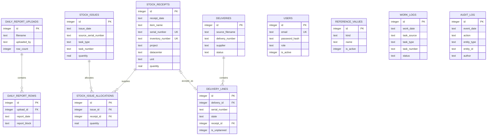

# Модель данных ODE

Диаграмма показывает рабочую модель. Таблицы `equipment`, `operations`,
`categories` и `locations` сохранены как legacy compatibility layer. Они не
являются источником современного баланса, но связанная `equipment` всё ещё
участвует в проверке/синхронизации Inventory Number.

Баланс вычисляется как сумма `stock_receipts.quantity` минус связанные `stock_issue_allocations.quantity`. Поставка создает обычную запись прихода и связывает ее со строкой через `delivery_lines.receipt_id`.

Stage 0.13.2 не меняет ER-схему. `stock_receipts.inventory_number` может быть
пуст при приходе и позже заполняется по S/N; partial unique index защищает
уникальность только непустых значений. При наличии `legacy_equipment_id`
пустой номер связанной legacy `equipment` синхронизируется той же транзакцией.
Audit action хранится в `audit_log` через generic `entity_type/entity_id`, а не
через новый foreign key или отдельную event-таблицу.
