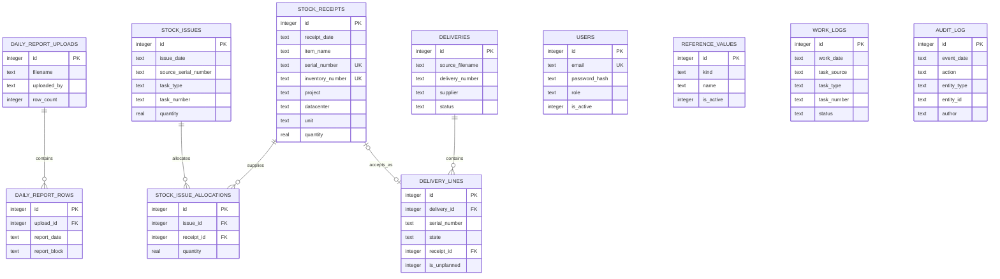
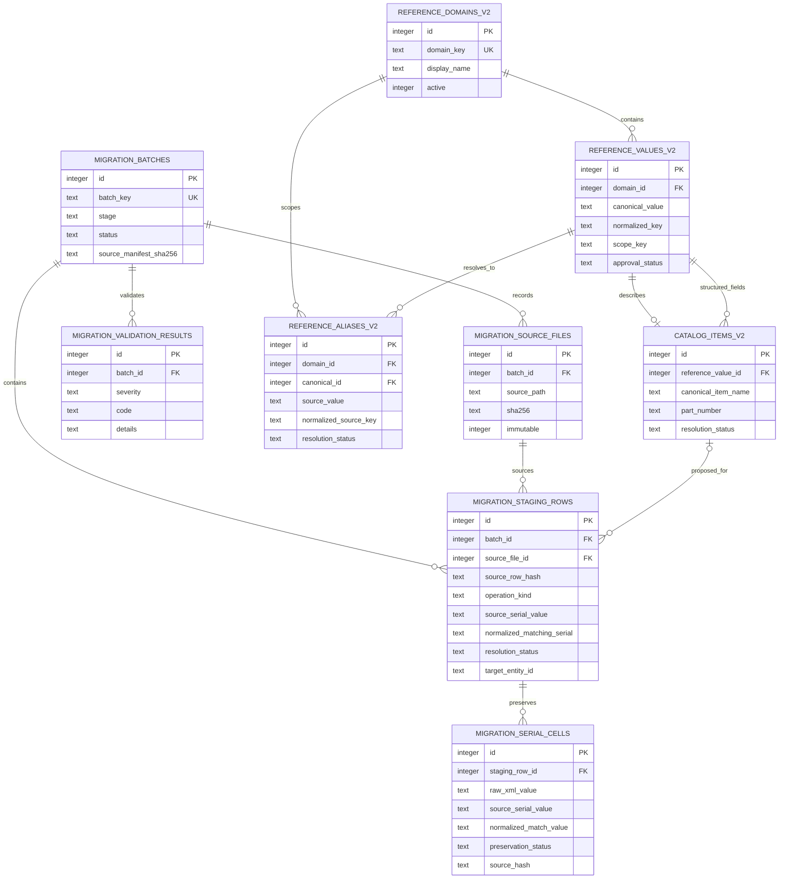
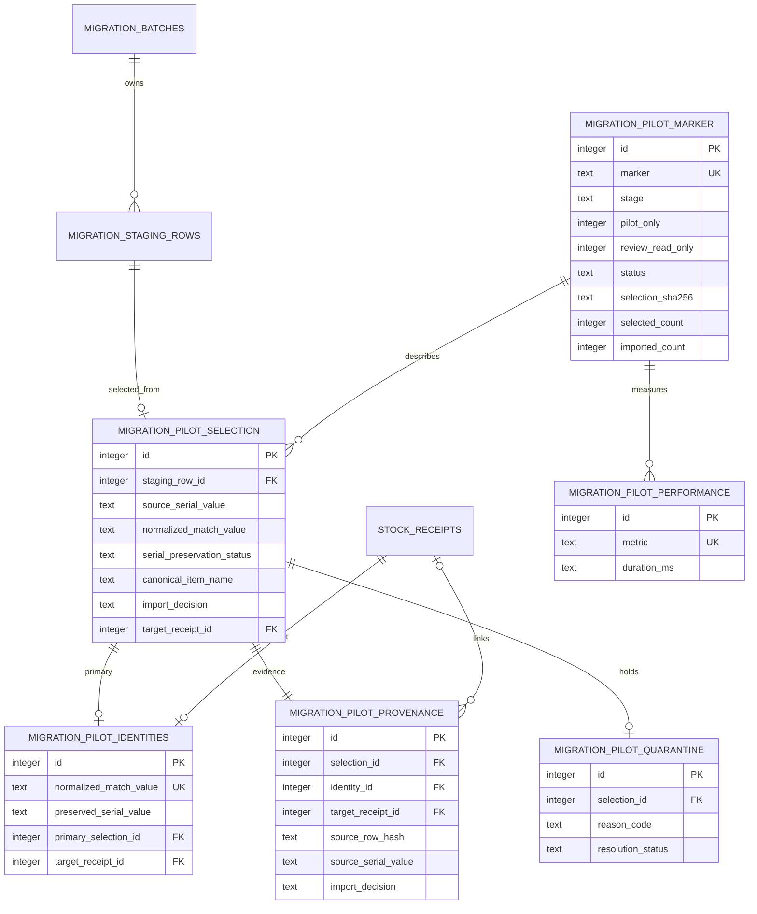

# Модель данных ODE

Первая диаграмма показывает production-модель source Stage 0.13.3A.5; runtime
metadata остаётся `0.12.17.1 RC2`. Таблицы `equipment`, `operations`,
`categories` и `locations` сохранены как legacy compatibility layer. Они не
являются источником современного баланса, но связанная `equipment` всё ещё
участвует в проверке/синхронизации Inventory Number.

Баланс вычисляется как сумма `stock_receipts.quantity` минус связанные `stock_issue_allocations.quantity`. Поставка создает обычную запись прихода и связывает ее со строкой через `delivery_lines.receipt_id`.

Stages 0.13.2, 0.13.3A и 0.13.3A.5 не меняют production ER-схему.
`stock_receipts.inventory_number` может быть
пуст при приходе и позже заполняется по S/N; partial unique index защищает
уникальность только непустых значений. При наличии `legacy_equipment_id`
пустой номер связанной legacy `equipment` синхронизируется той же транзакцией.
Audit action хранится в `audit_log` через generic `entity_type/entity_id`, а не
через новый foreign key или отдельную event-таблицу.

## Disposable candidate ER — IMPLEMENTED, не production

Следующие девять таблиц создаются только в ignored
`migration_inputs/workspace/warehouse_migration_candidate.db`. Они намеренно
не входят в `inventory/db.py` и не должны появляться в `data/warehouse.db`.

**FACT:** candidate также содержит clean production schema и security snapshot,
но все operational/audit tables проходят проверку на нулевое количество строк.
Production `reference_values` не заменяется `reference_values_v2`.

**PROPOSED/FUTURE STAGE:** перенос approved reference/staging data в рабочую
модель и возможная production reference migration требуют отдельного ADR и
reset/import workflow. **OPEN DECISION:** окончательная runtime ER для richer
references пока не утверждена.

## Disposable pilot ER — IMPLEMENTED / PILOT ONLY

Stage 0.13.3A.5 copies the validated Stage A candidate into a separate
`warehouse_pilot_candidate.db`, retains the nine candidate tables above and adds
six `migration_pilot_*` tables. They are forbidden in production
`inventory/db.py`.

The 130 `IMPORT` primaries and 41 linked duplicate/conflict source rows have
`target_receipt_id`; only the 130 primaries create stock. The other 29 rows are
quarantined/deferred/rejected and have no target. Duplicate/conflict source
rows link provenance to a primary identity but do not create a second receipt.
Pilot receipts have
quantity `1`, exact text S/N and `is_opening_balance=1`; shelf is not a key.

**NOT PRODUCTION / FUTURE 0.13.3B:** this ER is a disposable review result.
Production case-sensitive identity, richer references and historical event
storage remain separate ADR decisions.
