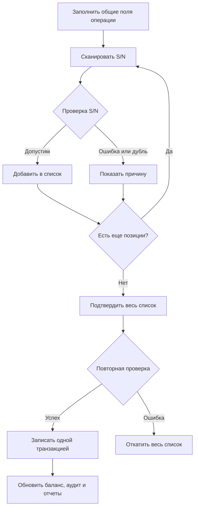
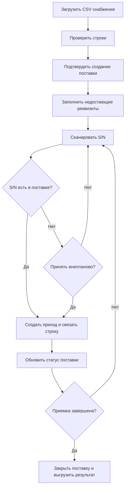
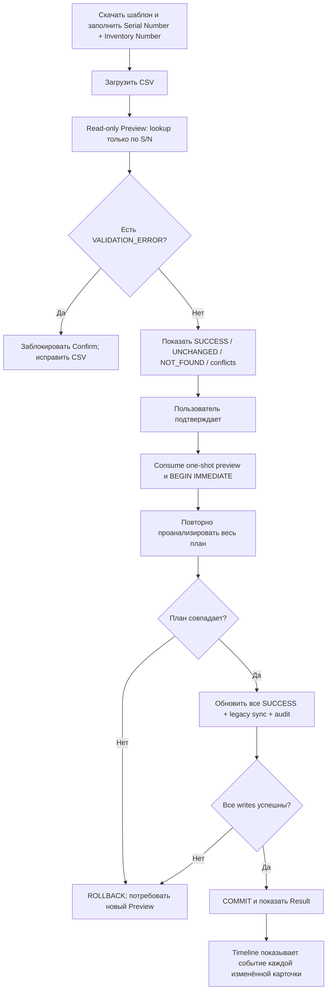
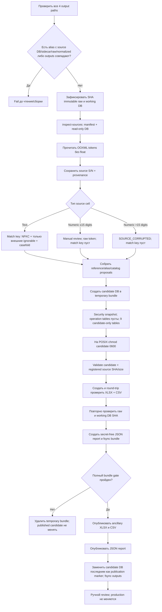
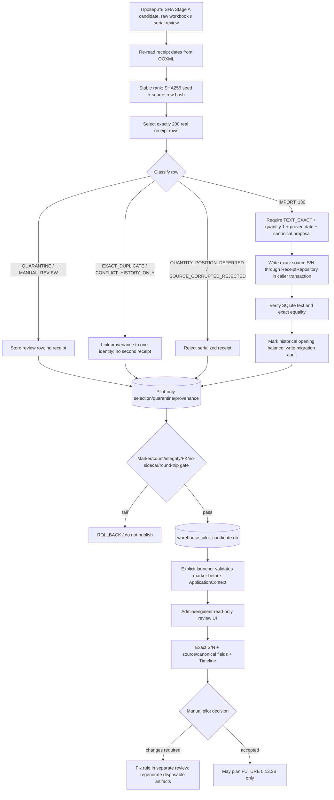

# Основные процессы ODE

Диаграммы актуальны для source Stage 0.13.3A.5; runtime metadata остаётся
`0.12.17.1 RC2`. Первые три процесса — production runtime. Последние два —
offline migration staging и marker-guarded read-only pilot.

## Приход и расход со сканером

При списании неизвестный S/N допускается как проблемная строка. Остальные ошибки подтверждения отменяют всю транзакцию.

## Приемка поставки

## Массовое назначение Inventory Number — Stage 0.13.2

Новые карточки не создаются, конфликтные строки не изменяются. Каноническая
sequence diagram и API-контракт:
[INVENTORY_NUMBER_IMPORT_ARCHITECTURE.md](INVENTORY_NUMBER_IMPORT_ARCHITECTURE.md).

## Reference Data Foundation и migration staging — Stage 0.13.3A

**IMPLEMENTED:** CLI предоставляет `inspect-sources`, `build-candidate`,
`validate-candidate`, `report`. Автоматически подтверждаются только
синтаксически безопасные aliases; canonical name — пересчитываемый display,
S/N — identity.

Все четыре output (`candidate DB`, reference XLSX, serial CSV и JSON report)
должны быть разными файлами. Path guard запрещает совпадение путей и
symlink-/hardlink-equivalence с working DB и её sidecars, любым raw source или
normalized review input, а также запись внутрь `raw/` и `normalized/`.
Default outputs находятся в ignored `migration_inputs/workspace`.
Standalone `report` повторно применяет тот же guard и полностью строит
allowlisted JSON из candidate/source checks, не читая и не объединяя старый
report-файл.

**FACT:** Stage 0.13.3A не создаёт приходы/расходы, не импортирует лист БАЛАНС,
не изменяет runtime `reference_values`, не сбрасывает и не заменяет
`data/warehouse.db`.

**FUTURE STAGE / OPEN DECISION:** approved staging может стать входом Stage
0.13.3B только после ручного решения по конфликтам и отдельного import/reset
contract.

## Preservation-aware receipt pilot — Stage 0.13.3A.5

The selector records the unavailable-source fact
`VEGMAN_R200_UNAVAILABLE_FROM_SOURCE`; it does not fabricate a row. Shelf is
history/placement and never branches identity. All operational POST mutations
are denied in pilot mode. No arrow from this process writes or replaces
`data/warehouse.db`.
