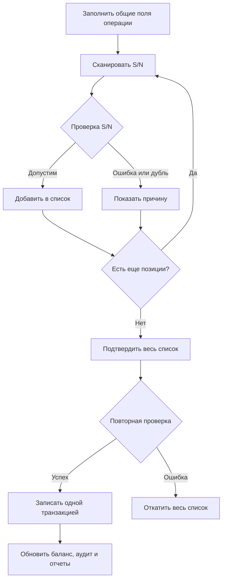
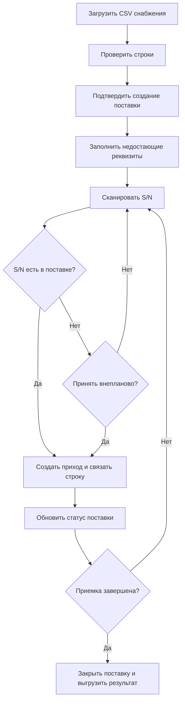
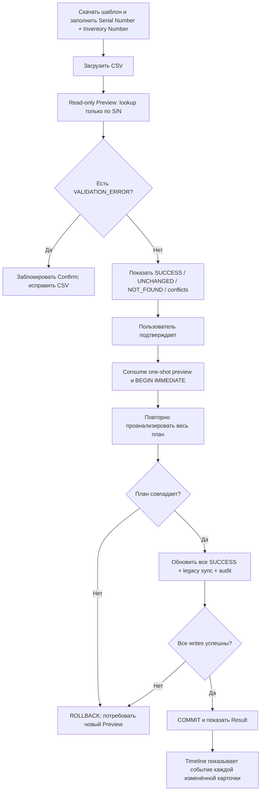

# Основные процессы ODE

## Приход и расход со сканером

При списании неизвестный S/N допускается как проблемная строка. Остальные ошибки подтверждения отменяют всю транзакцию.

## Приемка поставки

## Массовое назначение Inventory Number — Stage 0.13.2

Новые карточки не создаются, конфликтные строки не изменяются. Каноническая
sequence diagram и API-контракт:
[INVENTORY_NUMBER_IMPORT_ARCHITECTURE.md](INVENTORY_NUMBER_IMPORT_ARCHITECTURE.md).
